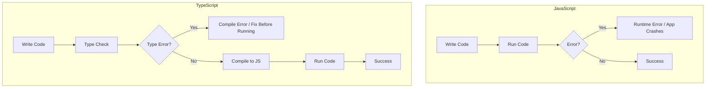
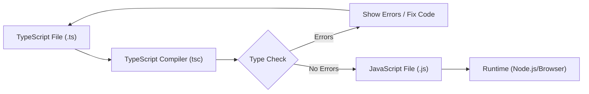

# Lesson 1: Introduction to TypeScript

## What is TypeScript?

**TypeScript** is a **superset of JavaScript** developed by Microsoft that adds static type checking to JavaScript. It compiles to plain JavaScript and helps catch errors before runtime, making your code more reliable and maintainable.

### Key Characteristics

- **Superset of JavaScript**: All valid JavaScript code is valid TypeScript
- **Static Type Checking**: Types are checked at compile-time, not runtime
- **Compiles to JavaScript**: TypeScript code is transpiled to JavaScript that runs in any browser or Node.js
- **Gradual Adoption**: You can add TypeScript incrementally to existing JavaScript projects

### Why Use TypeScript?

**Advantages:**
- ✅ **Type Safety**: Catch errors during development, not in production
- ✅ **Better IDE Support**: Autocomplete, refactoring, and navigation
- ✅ **Documentation**: Types serve as inline documentation
- ✅ **Modern Features**: Access to latest JavaScript features with type safety
- ✅ **Large-Scale Development**: Better for teams and large codebases
- ✅ **Refactoring Confidence**: Types help ensure changes don't break code

**When TypeScript is Especially Valuable:**
- Large codebases with multiple developers
- Long-term maintenance projects
- Complex business logic
- API development
- Libraries and frameworks

**When Plain JavaScript Might Be Better:**
- Quick prototypes or scripts
- Very small projects
- Learning JavaScript fundamentals
- Projects with strict build-time constraints

#### Visual: TypeScript vs JavaScript



## Your First TypeScript Program

Let's create a simple TypeScript program to see how it works:

```typescript
// greeting.ts
/**
 * Greets a person by name
 * @param name - The name of the person to greet
 * @returns A greeting message
 */
function greet(name: string): string {
  return `Hello, ${name}!`;
}

// Call the function
const message = greet("TypeScript");
console.log(message); // Output: "Hello, TypeScript!"
```

**Key Points Explained:**

1. **`name: string`** - Parameter type annotation
   - Tells TypeScript that `name` must be a string
   - If you pass a number, TypeScript will show an error

2. **`: string`** - Return type annotation
   - Specifies that the function returns a string
   - TypeScript will ensure the function always returns a string

3. **Type Inference** - TypeScript infers `message` is a string
   - You don't need to write `const message: string`
   - TypeScript knows from the function's return type

### Running TypeScript

There are several ways to run TypeScript code:

#### Method 1: Using ts-node (Recommended for Learning)

```bash
# Install ts-node globally (one time)
npm install -g ts-node

# Run TypeScript file directly
npx ts-node greeting.ts
```

**Advantages:**
- No compilation step needed
- Great for learning and quick testing
- Shows errors immediately

#### Method 2: Compile Then Run

```bash
# Compile TypeScript to JavaScript
npx tsc greeting.ts

# This creates greeting.js
# Run the compiled JavaScript
node greeting.js
```

**Advantages:**
- See the compiled JavaScript output
- Understand what TypeScript generates
- Production-ready approach

#### Method 3: Using a Build Tool

```bash
# With a build tool like tsx
npx tsx greeting.ts
```

## Type Annotations

Type annotations explicitly tell TypeScript what type a value should be:

```typescript
// Explicit type annotations
let age: number = 25;
let name: string = "Alice";
let isActive: boolean = true;
let scores: number[] = [95, 87, 92]; // Array of numbers
```

**When to Use Explicit Annotations:**
- Function parameters and return types
- Variables that will be reassigned with different types
- Complex types that aren't obvious
- Public API boundaries

**When TypeScript Can Infer:**
- Variables with initial values
- Simple assignments
- Most local variables

### Example: Type Annotation Benefits

```typescript
// Without type annotation - TypeScript infers 'any'
let data; // Type: any (not recommended)
data = "Hello";
data = 42; // No error, but could cause issues later

// With type annotation - TypeScript enforces the type
let count: number = 10;
// count = "ten"; // Error: Type 'string' is not assignable to type 'number'
```

## Type Inference

TypeScript automatically infers types when you provide initial values:

```typescript
// TypeScript infers the types automatically
let age = 25;        // Inferred as: number
let name = "Alice";  // Inferred as: string
let isActive = true; // Inferred as: boolean
let items = [1, 2, 3]; // Inferred as: number[]
```

**How Type Inference Works:**

```typescript
// TypeScript looks at the initial value
let x = 10; // TypeScript sees: number literal 10
// Therefore: x is of type 'number'

let y = "hello"; // TypeScript sees: string literal "hello"
// Therefore: y is of type 'string'
```

**Benefits of Type Inference:**
- Less code to write
- Still get type safety
- Easier to read
- TypeScript handles the types for you

**When Inference Doesn't Work:**
```typescript
// No initial value - TypeScript can't infer
let value; // Type: any (not type-safe)
value = 10;
value = "hello"; // No error, but not type-safe

// Solution: Provide type annotation
let value: number;
value = 10;
// value = "hello"; // Error: Type 'string' is not assignable to type 'number'
```

## TypeScript Compilation Process

#### Visual: TypeScript Compilation Flow



## Best Practices

### 1. Start with Type Inference

**DO:**
```typescript
// Let TypeScript infer when possible
const name = "Alice"; // TypeScript knows it's a string
const age = 25; // TypeScript knows it's a number
```

**DON'T:**
```typescript
// Unnecessary type annotations
const name: string = "Alice"; // Redundant
const age: number = 25; // Redundant
```

### 2. Use Explicit Types for Function Signatures

**DO:**
```typescript
// Always annotate function parameters and return types
function calculateTotal(price: number, quantity: number): number {
  return price * quantity;
}
```

**DON'T:**
```typescript
// Missing type annotations
function calculateTotal(price, quantity) { // What types are these?
  return price * quantity;
}
```

### 3. Avoid the `any` Type

**DO:**
```typescript
// Use specific types
function processData(data: string): string {
  return data.toUpperCase();
}
```

**DON'T:**
```typescript
// Using 'any' defeats the purpose of TypeScript
function processData(data: any): any {
  return data.toUpperCase(); // Might fail at runtime
}
```

### 4. Use `const` for Values That Don't Change

**DO:**
```typescript
const PI = 3.14159; // Constant value
const API_URL = "https://api.example.com"; // Constant configuration
```

**DON'T:**
```typescript
let PI = 3.14159; // Should be const
let API_URL = "https://api.example.com"; // Should be const
```

## Common Pitfalls and Solutions

### Pitfall 1: Forgetting Type Annotations on Function Parameters

**Problem:**
```typescript
// ❌ TypeScript infers 'any' for parameters without types
function greet(name) {
  return `Hello, ${name}!`;
}
// Error: Parameter 'name' implicitly has an 'any' type
```

**Solution:**
```typescript
// ✅ Always type function parameters
function greet(name: string): string {
  return `Hello, ${name}!`;
}
```

### Pitfall 2: Assuming Type Inference Works Everywhere

**Problem:**
```typescript
// ❌ No initial value means 'any' type
let value;
value = 10;
value = "hello"; // No error, but not type-safe
```

**Solution:**
```typescript
// ✅ Provide type annotation when no initial value
let value: number;
value = 10;
// value = "hello"; // Error: Type 'string' is not assignable to type 'number'
```

### Pitfall 3: Not Understanding Compilation vs Runtime

**Problem:**
```typescript
// TypeScript compiles this without error
let x: number = 10;
x = "hello" as any; // Type assertion bypasses type checking
// At runtime, x is a string, but TypeScript thinks it's a number
```

**Solution:**
```typescript
// ✅ Avoid type assertions unless absolutely necessary
let x: number = 10;
// If you need to change types, use proper type handling
let y: string | number = 10;
y = "hello"; // OK with union type
```

### Pitfall 4: Ignoring TypeScript Errors

**Problem:**
```typescript
// ❌ Using @ts-ignore to suppress errors
// @ts-ignore
let x: number = "hello"; // This will cause runtime errors
```

**Solution:**
```typescript
// ✅ Fix the actual type issue
let x: string = "hello"; // Correct type
// Or use proper type conversion
let y: number = parseInt("123", 10); // Convert string to number
```

## Real-World Example: Type Safety in Action

Here's how TypeScript helps in a real application:

```typescript
// User management example
interface User {
  id: number;
  name: string;
  email: string;
  age: number;
}

/**
 * Creates a user object with validation
 * @param name - User's full name
 * @param email - User's email address
 * @param age - User's age (must be 18+)
 * @returns A new User object
 */
function createUser(name: string, email: string, age: number): User {
  // TypeScript ensures we return the correct structure
  if (age < 18) {
    throw new Error("User must be 18 or older");
  }
  
  return {
    id: Math.floor(Math.random() * 1000),
    name, // Shorthand for name: name
    email,
    age,
  };
}

// TypeScript catches errors at compile time
const user1 = createUser("Alice", "alice@example.com", 25); // ✅ Valid
// const user2 = createUser("Bob", "bob@example.com", "17"); // ❌ Error: age must be number
// const user3 = createUser("Charlie", 123, 30); // ❌ Error: email must be string

// TypeScript provides autocomplete
console.log(user1.name); // ✅ TypeScript knows 'name' exists
// console.log(user1.phone); // ❌ Error: Property 'phone' does not exist
```

## Troubleshooting

### Issue: "Cannot find name 'console'"

**Symptoms:**
```text
Error: Cannot find name 'console'. Do you need to change your target library?
```

**Solutions:**
1. Check `tsconfig.json` includes Node.js types:
   ```json
   {
     "compilerOptions": {
       "lib": ["ES2022"],
       "types": ["node"]
     }
   }
   ```

2. Install Node.js type definitions:
   ```bash
   pnpm add -D @types/node
   ```

### Issue: "File is not a module"

**Symptoms:**
```text
Error: File is not a module
```

**Solutions:**
1. Add an import or export statement:
   ```typescript
   // Add this at the top
   export {};
   ```

2. Or ensure `tsconfig.json` has proper module settings:
   ```json
   {
     "compilerOptions": {
       "module": "ES2022" or "CommonJS"
     }
   }
   ```

### Issue: TypeScript not showing errors in IDE

**Symptoms:**
- No red squiggles for type errors
- Autocomplete not working

**Solutions:**
1. Restart TypeScript server in VS Code: `Ctrl+Shift+P` → "TypeScript: Restart TS Server"
2. Check TypeScript is installed: `npx tsc --version`
3. Verify `tsconfig.json` exists in project root
4. Check IDE TypeScript version matches project version

### Issue: "Cannot find module" errors

**Symptoms:**
```text
Error: Cannot find module './module' or its corresponding type declarations
```

**Solutions:**
1. Check file extensions in imports:
   ```typescript
   // ✅ Correct
   import { something } from './module';
   
   // ❌ Wrong (don't include .ts extension)
   import { something } from './module.ts';
   ```

2. Ensure module resolution is correct in `tsconfig.json`:
   ```json
   {
     "compilerOptions": {
       "moduleResolution": "node"
     }
   }
   ```

## Next Steps

Now that you understand TypeScript basics:

1. ✅ **Practice**: Create a few TypeScript files and experiment
2. ✅ **Try Errors**: Intentionally create type errors to see how TypeScript catches them
3. 📖 **Next Lesson**: Learn about [Types and Variables](./lesson-02-types-and-variables.md)
4. 💻 **Complete Exercises**: Work through [Exercises 01](./exercises-01.md)

## Additional Resources

- [TypeScript Official Documentation](https://www.typescriptlang.org/docs/)
- [TypeScript Playground](https://www.typescriptlang.org/play) - Try TypeScript in your browser
- [TypeScript Handbook](https://www.typescriptlang.org/docs/handbook/intro.html)

---

**Key Takeaways:**
- TypeScript adds type safety to JavaScript
- Types are checked at compile-time, catching errors early
- Use type annotations for function parameters and return types
- Let TypeScript infer types when possible
- Avoid the `any` type to maintain type safety
- TypeScript compiles to JavaScript, so it runs anywhere JavaScript runs
