# Lesson 2: Types and Variables

## Understanding TypeScript Types

TypeScript provides a rich type system that helps catch errors before your code runs. Understanding basic types is fundamental to writing type-safe TypeScript code.

### Why Types Matter

**Benefits of Type Safety:**
- ✅ **Catch Errors Early**: Type mismatches are caught at compile-time
- ✅ **Better IDE Support**: Autocomplete and IntelliSense work better
- ✅ **Self-Documenting Code**: Types explain what data is expected
- ✅ **Refactoring Safety**: Types help ensure changes don't break code
- ✅ **Team Collaboration**: Types make code easier to understand

## Basic Types

TypeScript provides several built-in primitive types that correspond to JavaScript's basic value types.

### Number

The `number` type represents both integers and floating-point numbers:

```typescript
// Integers
let age: number = 25;
let count: number = 0;
let negative: number = -10;

// Floating-point numbers
let price: number = 19.99;
let temperature: number = -5.5;
let pi: number = 3.14159;

// Special number values
let infinity: number = Infinity;
let notANumber: number = NaN; // Still typed as number
```

**Key Points:**
- TypeScript doesn't distinguish between integers and floats (unlike some languages)
- All numeric values use the `number` type
- `NaN` and `Infinity` are also of type `number`

**Common Operations:**
```typescript
let a: number = 10;
let b: number = 3;

let sum: number = a + b;        // 13
let difference: number = a - b;  // 7
let product: number = a * b;     // 30
let quotient: number = a / b;   // 3.333...
let remainder: number = a % b;   // 1
let power: number = a ** b;      // 1000 (exponentiation)
```

### String

The `string` type represents text data:

```typescript
// Double quotes
let name: string = "Alice";
let message: string = "Hello, World!";

// Single quotes (equivalent)
let greeting: string = 'Hello, TypeScript!';

// Template literals (backticks) - recommended for modern code
let firstName: string = "John";
let lastName: string = "Doe";
let fullName: string = `${firstName} ${lastName}`; // "John Doe"

// Multi-line strings with template literals
let multiline: string = `
  This is a
  multi-line
  string
`;
```

**String Operations:**
```typescript
let str1: string = "Hello";
let str2: string = "World";

let combined: string = str1 + " " + str2; // "Hello World"
let length: number = str1.length;          // 5
let upper: string = str1.toUpperCase();    // "HELLO"
let lower: string = str1.toLowerCase();    // "hello"
```

**Template Literals Benefits:**
- Variable interpolation: `` `${name}` ``
- Multi-line strings without concatenation
- Expression evaluation: `` `${a + b}` ``

### Boolean

The `boolean` type represents logical values - `true` or `false`:

```typescript
let isActive: boolean = true;
let isComplete: boolean = false;
let hasPermission: boolean = true;

// Boolean expressions
let isGreater: boolean = 10 > 5;        // true
let isEqual: boolean = 10 === 10;       // true
let isNotEqual: boolean = 10 !== 5;     // true
```

**Important Note:**
```typescript
// ❌ Don't use Boolean() constructor - it creates an object, not a primitive
let wrong: Boolean = new Boolean(true); // Type: Boolean (object)

// ✅ Use boolean type for primitive values
let correct: boolean = true; // Type: boolean (primitive)
```

### Undefined and Null

TypeScript has two special types for "no value":

```typescript
// undefined - variable declared but not assigned
let value: undefined = undefined;
let unassigned: number | undefined; // Can be number or undefined

// null - explicitly set to "no value"
let data: null = null;
let empty: string | null = null; // Can be string or null
```

**Key Differences:**
- `undefined`: Variable exists but has no value assigned
- `null`: Variable explicitly set to "no value" (intentional)

**Union Types with null/undefined:**
```typescript
// Common pattern: value that might not exist
let maybe: string | null = null;
let optional: number | undefined = undefined;

// Both null and undefined
let flexible: string | null | undefined;
```

#### Visual: Type System Overview


## Variable Declarations

TypeScript supports three ways to declare variables, each with different scoping and mutability rules.

### `let` - Block-Scoped, Mutable

`let` allows reassignment and is scoped to the nearest block:

```typescript
let count: number = 0;
count = 10;        // ✅ Can be reassigned
count = 20;        // ✅ Can be reassigned again

// Block scoping
if (true) {
  let blockScoped: number = 5;
  // blockScoped is only available in this block
}
// console.log(blockScoped); // ❌ Error: blockScoped is not defined
```

**When to Use `let`:**
- Variables that will be reassigned
- Loop counters
- Variables that change over time

### `const` - Block-Scoped, Immutable

`const` prevents reassignment (but object properties can still change):

```typescript
const PI: number = 3.14159;
// PI = 3.14; // ❌ Error: Cannot assign to 'PI' because it is a constant

const API_URL: string = "https://api.example.com";
// API_URL = "https://other.com"; // ❌ Error: Cannot reassign

// const with objects - the reference is constant, but properties can change
const user = { name: "Alice", age: 25 };
user.age = 26; // ✅ OK - object properties can change
// user = { name: "Bob" }; // ❌ Error - cannot reassign the variable
```

**When to Use `const`:**
- Constants that never change
- Configuration values
- Most variables (preferred by default)
- Object/array references (even if contents change)

**Best Practice:** Use `const` by default, only use `let` when you need to reassign.

### `var` - Function-Scoped (Avoid in Modern TypeScript)

`var` is the old way to declare variables. **Avoid using it** in modern TypeScript:

```typescript
var oldWay: number = 5; // ❌ Not recommended

// Problems with var:
// 1. Function-scoped, not block-scoped
if (true) {
  var functionScoped = 10;
}
console.log(functionScoped); // ✅ Works (unexpected!)

// 2. Hoisting issues
console.log(hoisted); // undefined (not an error!)
var hoisted = "value";

// 3. Can be redeclared
var x = 1;
var x = 2; // ✅ No error (can cause confusion)
```

**Why Avoid `var`:**
- Function-scoped (not block-scoped) causes unexpected behavior
- Hoisting can lead to bugs
- Can be redeclared, causing confusion
- `let` and `const` are better alternatives

#### Visual: Variable Declaration Comparison

```mermaid
graph TB
    A[Variable Declaration] --> B[let]
    A --> C[const]
    A --> D[var]
    
    B --> B1["✅ Block-scoped<br/>✅ Mutable<br/>✅ No hoisting issues"]
    C --> C1["✅ Block-scoped<br/>✅ Immutable reference<br/>✅ Preferred default"]
    D --> D1["❌ Function-scoped<br/>❌ Hoisting issues<br/>❌ Avoid in modern TS"]
    
    style B fill:#e8f5e9
    style C fill:#e8f5e9
    style D fill:#ffebee
```



## Type Inference

TypeScript automatically infers types when you provide initial values, reducing the need for explicit type annotations:

```typescript
// TypeScript infers the types automatically
let age = 25;        // Inferred as: number
let name = "Alice";  // Inferred as: string
let active = true;   // Inferred as: boolean
let items = [1, 2, 3]; // Inferred as: number[]
```

**How Type Inference Works:**

```typescript
// TypeScript looks at the initial value
let x = 10;           // TypeScript sees: number literal 10
                      // Therefore: x is of type 'number'

let y = "hello";      // TypeScript sees: string literal "hello"
                      // Therefore: y is of type 'string'

let z = true;         // TypeScript sees: boolean literal true
                      // Therefore: z is of type 'boolean'
```

**Benefits:**
- Less code to write
- Still get full type safety
- Easier to read
- TypeScript handles types automatically

**When Inference Doesn't Work:**
```typescript
// ❌ No initial value - TypeScript can't infer
let value; // Type: any (not type-safe!)
value = 10;
value = "hello"; // No error, but not type-safe

// ✅ Solution: Provide type annotation
let value: number;
value = 10;
// value = "hello"; // Error: Type 'string' is not assignable to type 'number'
```

## The `any` Type (Use Sparingly)

The `any` type disables type checking. **Avoid it** when possible:

```typescript
let anything: any = "can be anything";
anything = 42;        // ✅ No error
anything = true;      // ✅ No error
anything.foo.bar.baz; // ✅ No error (but might crash at runtime!)
```

**Why `any` is Problematic:**
- Disables type checking (defeats TypeScript's purpose)
- No autocomplete or IntelliSense
- Can cause runtime errors
- Makes code harder to maintain

**When `any` Might Be Acceptable:**
- Migrating JavaScript to TypeScript (temporary)
- Working with truly dynamic data (rare)
- Third-party libraries without types (use `unknown` instead when possible)

**Better Alternatives:**
```typescript
// ❌ Using any
function process(data: any) {
  return data.something;
}

// ✅ Use specific types
function process(data: { something: string }) {
  return data.something;
}

// ✅ Use unknown for truly unknown data
function process(data: unknown) {
  if (typeof data === 'object' && data !== null && 'something' in data) {
    return (data as { something: string }).something;
  }
  throw new Error('Invalid data');
}
```

## Type Annotations

Type annotations explicitly tell TypeScript what type a value should be:

```typescript
// Explicit type annotations
let age: number;
age = 25; // ✅ OK
// age = "twenty-five"; // ❌ Error: Type 'string' is not assignable to type 'number'

let name: string = "Alice";
let isActive: boolean = true;
let scores: number[] = [95, 87, 92];
```

**When to Use Explicit Annotations:**

1. **Function Parameters and Return Types:**
   ```typescript
   function greet(name: string): string {
     return `Hello, ${name}!`;
   }
   ```

2. **Variables Without Initial Values:**
   ```typescript
   let value: number; // Must annotate - no initial value
   value = 10;
   ```

3. **Complex Types:**
   ```typescript
   let user: { name: string; age: number } = { name: "Alice", age: 25 };
   ```

4. **Public API Boundaries:**
   ```typescript
   // Export functions should have explicit types
   export function calculateTotal(price: number, quantity: number): number {
     return price * quantity;
   }
   ```

**When TypeScript Can Infer (Don't Annotate):**
- Variables with initial values
- Simple local variables
- Most `const` declarations

## Best Practices

### 1. Prefer `const` Over `let`

**DO:**
```typescript
// Use const by default
const name = "Alice";
const age = 25;
const config = { apiUrl: "https://api.example.com" };
```

**DON'T:**
```typescript
// Don't use let unless you need to reassign
let name = "Alice"; // Should be const
let age = 25; // Should be const
```

### 2. Let TypeScript Infer When Possible

**DO:**
```typescript
// Let TypeScript infer simple types
const age = 25; // TypeScript knows it's a number
const name = "Alice"; // TypeScript knows it's a string
```

**DON'T:**
```typescript
// Unnecessary annotations
const age: number = 25; // Redundant
const name: string = "Alice"; // Redundant
```

### 3. Always Annotate Function Signatures

**DO:**
```typescript
// Always type function parameters and returns
function calculate(price: number, quantity: number): number {
  return price * quantity;
}
```

**DON'T:**
```typescript
// Missing types
function calculate(price, quantity) { // What types are these?
  return price * quantity;
}
```

### 4. Avoid `any` Type

**DO:**
```typescript
// Use specific types
function process(data: string): string {
  return data.toUpperCase();
}
```

**DON'T:**
```typescript
// Using any defeats TypeScript
function process(data: any): any {
  return data.toUpperCase(); // Might fail at runtime
}
```

### 5. Use Descriptive Variable Names

**DO:**
```typescript
const userAge = 25;
const isUserActive = true;
const apiBaseUrl = "https://api.example.com";
```

**DON'T:**
```typescript
const a = 25; // What does 'a' mean?
const flag = true; // What flag?
const url = "https://api.example.com"; // Too generic
```

## Common Pitfalls and Solutions

### Pitfall 1: Using `var` Instead of `let` or `const`

**Problem:**
```typescript
// ❌ var has function scope and hoisting issues
for (var i = 0; i < 3; i++) {
  setTimeout(() => console.log(i), 100); // Prints: 3, 3, 3
}
```

**Solution:**
```typescript
// ✅ Use let for block scope
for (let i = 0; i < 3; i++) {
  setTimeout(() => console.log(i), 100); // Prints: 0, 1, 2
}
```

### Pitfall 2: Assuming `const` Makes Objects Immutable

**Problem:**
```typescript
// ❌ const doesn't make object properties immutable
const user = { name: "Alice", age: 25 };
user.age = 26; // ✅ This works! (might be unexpected)
```

**Solution:**
```typescript
// ✅ Use readonly or Object.freeze() for immutability
const user = Object.freeze({ name: "Alice", age: 25 });
// user.age = 26; // ❌ Error in strict mode, or silently fails
```

### Pitfall 3: Not Annotating Variables Without Initial Values

**Problem:**
```typescript
// ❌ TypeScript infers 'any' when no initial value
let value;
value = 10;
value = "hello"; // No error, but not type-safe
```

**Solution:**
```typescript
// ✅ Provide type annotation
let value: number;
value = 10;
// value = "hello"; // Error: Type 'string' is not assignable to type 'number'
```

### Pitfall 4: Using `any` to Avoid Type Errors

**Problem:**
```typescript
// ❌ Using any to bypass type checking
function process(data: any): any {
  return data.something.else; // Might crash at runtime
}
```

**Solution:**
```typescript
// ✅ Use proper types or unknown
interface Data {
  something: {
    else: string;
  };
}

function process(data: Data): string {
  return data.something.else; // Type-safe
}
```

### Pitfall 5: Confusing `null` and `undefined`

**Problem:**
```typescript
// ❌ Not understanding the difference
let value: string = null; // Error: Type 'null' is not assignable to type 'string'
```

**Solution:**
```typescript
// ✅ Use union types when value might be null/undefined
let value: string | null = null; // OK
let optional: string | undefined = undefined; // OK
let flexible: string | null | undefined; // Can be any of the three
```

## Real-World Example: Type-Safe Configuration

Here's how types help in a real application:

```typescript
// Application configuration with types
interface AppConfig {
  apiUrl: string;
  timeout: number;
  retries: number;
  features: {
    darkMode: boolean;
    analytics: boolean;
  };
}

// Type-safe configuration
const config: AppConfig = {
  apiUrl: "https://api.example.com",
  timeout: 5000,
  retries: 3,
  features: {
    darkMode: true,
    analytics: false,
  },
};

// TypeScript ensures correct structure
// config.apiUrl = 123; // ❌ Error: Type 'number' is not assignable to type 'string'
// config.timeout = "5000"; // ❌ Error: Type 'string' is not assignable to type 'number'

// TypeScript provides autocomplete
console.log(config.features.darkMode); // ✅ TypeScript knows this exists
// console.log(config.features.theme); // ❌ Error: Property 'theme' does not exist

// Environment-based configuration
const env: string = process.env.NODE_ENV || "development";
const isProduction: boolean = env === "production";

// Type-safe environment variables
const apiUrl: string = process.env.API_URL || "http://localhost:3001";
const port: number = parseInt(process.env.PORT || "3000", 10);
```

## Troubleshooting

### Issue: "Type 'null' is not assignable to type 'string'"

**Symptoms:**
```
Error: Type 'null' is not assignable to type 'string'
```

**Solutions:**
1. Use union types:
   ```typescript
   let value: string | null = null; // OK
   ```

2. Use optional chaining:
   ```typescript
   let value: string | null = null;
   let length = value?.length; // OK, returns undefined if value is null
   ```

### Issue: "Variable 'x' is used before being assigned"

**Symptoms:**
```
Error: Variable 'x' is used before being assigned
```

**Solutions:**
1. Initialize the variable:
   ```typescript
   let x: number = 0; // Initialize with a value
   ```

2. Use definite assignment assertion (if you're sure it will be assigned):
   ```typescript
   let x!: number; // Tell TypeScript you'll assign it before use
   x = 10;
   ```

### Issue: "Cannot redeclare block-scoped variable"

**Symptoms:**
```
Error: Cannot redeclare block-scoped variable 'x'
```

**Solutions:**
1. Use different variable names:
   ```typescript
   let x = 1;
   let y = 2; // Use different name
   ```

2. Use block scope:
   ```typescript
   {
     let x = 1;
   }
   {
     let x = 2; // OK - different scope
   }
   ```

### Issue: Type inference not working as expected

**Symptoms:**
- TypeScript infers `any` instead of specific type
- Autocomplete not working

**Solutions:**
1. Provide explicit type annotation:
   ```typescript
   let value: number = getValue(); // Explicit type
   ```

2. Check `tsconfig.json` strict mode:
   ```json
   {
     "compilerOptions": {
       "strict": true,
       "noImplicitAny": true
     }
   }
   ```

## Next Steps

Now that you understand types and variables:

1. ✅ **Practice**: Create variables with different types
2. ✅ **Experiment**: Try type errors to see how TypeScript catches them
3. 📖 **Next Lesson**: Learn about [Basic Operations](./lesson-03-basic-operations.md)
4. 💻 **Complete Exercises**: Work through [Exercises 01](./exercises-01.md)

## Additional Resources

- [TypeScript Handbook: Basic Types](https://www.typescriptlang.org/docs/handbook/2/everyday-types.html)
- [TypeScript Handbook: Variable Declarations](https://www.typescriptlang.org/docs/handbook/variable-declarations.html)

---

**Key Takeaways:**
- TypeScript has primitive types: `number`, `string`, `boolean`, `null`, `undefined`
- Use `const` by default, `let` when you need to reassign, avoid `var`
- TypeScript infers types from initial values
- Always annotate function parameters and return types
- Avoid the `any` type to maintain type safety
- Use union types (`|`) for values that can be multiple types
