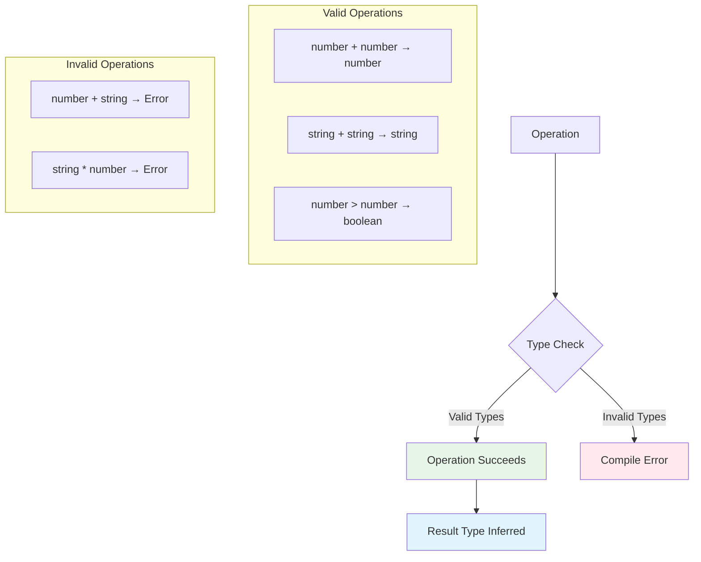

# Lesson 3: Basic Operations and Type Safety

## Understanding Operations in TypeScript

TypeScript enforces type safety in all operations, ensuring that you can only perform operations that make sense for the given types. This prevents common runtime errors.

### Why Type Safety in Operations Matters

**Benefits:**
- ✅ **Prevent Runtime Errors**: Catch type mismatches before code runs
- ✅ **Clearer Intent**: Types make operations explicit
- ✅ **Better Refactoring**: Types help ensure operations remain valid after changes
- ✅ **Documentation**: Types document what operations are valid

## Arithmetic Operations

TypeScript ensures arithmetic operations are performed on numbers:

```typescript
let a: number = 10;
let b: number = 5;

// Basic arithmetic operations
let sum: number = a + b;        // 15
let difference: number = a - b;  // 5
let product: number = a * b;    // 50
let quotient: number = a / b;   // 2
let remainder: number = a % b;   // 0 (modulo)
let power: number = a ** b;     // 100000 (exponentiation)

// Unary operations
let negative: number = -a;       // -10
let positive: number = +a;       // 10
let increment: number = ++a;     // 11 (a is now 11)
let decrement: number = --a;      // 10 (a is now 10)
```

**Type Safety in Arithmetic:**
```typescript
let num1: number = 10;
let num2: number = 5;

let result = num1 + num2; // ✅ OK: number + number = number

// let error = num1 + "5"; // ❌ Error: Operator '+' cannot be applied to types 'number' and 'string'
```

**Common Arithmetic Patterns:**
```typescript
// Percentage calculation
let total: number = 100;
let percentage: number = 15;
let amount: number = (total * percentage) / 100; // 15

// Rounding
let price: number = 19.99;
let rounded: number = Math.round(price);      // 20
let floored: number = Math.floor(price);      // 19
let ceiled: number = Math.ceil(price);        // 20

// Random numbers
let random: number = Math.random();                    // 0 to 1
let randomInt: number = Math.floor(Math.random() * 10); // 0 to 9
```

## String Operations

TypeScript provides type-safe string operations:

```typescript
let firstName: string = "John";
let lastName: string = "Doe";

// String concatenation
let fullName: string = firstName + " " + lastName; // "John Doe"
let greeting: string = "Hello, " + firstName + "!"; // "Hello, John!"

// Template literals (recommended)
let message: string = `Hello, ${firstName} ${lastName}!`; // "Hello, John Doe!"
let multiline: string = `
  First Name: ${firstName}
  Last Name: ${lastName}
`;
```

**String Methods (Type-Safe):**
```typescript
let text: string = "Hello, TypeScript!";

let length: number = text.length;                    // 19
let upper: string = text.toUpperCase();             // "HELLO, TYPESCRIPT!"
let lower: string = text.toLowerCase();             // "hello, typescript!"
let trimmed: string = "  hello  ".trim();           // "hello"
let substring: string = text.substring(0, 5);       // "Hello"
let replaced: string = text.replace("TypeScript", "World"); // "Hello, World!"
```

**Template Literal Benefits:**
```typescript
// Variable interpolation
let name: string = "Alice";
let age: number = 25;
let info: string = `Name: ${name}, Age: ${age}`; // "Name: Alice, Age: 25"

// Expression evaluation
let a: number = 10;
let b: number = 5;
let calculation: string = `${a} + ${b} = ${a + b}`; // "10 + 5 = 15"

// Multi-line strings
let html: string = `
  <div>
    <h1>${name}</h1>
    <p>Age: ${age}</p>
  </div>
`;
```

## Type Inference in Operations

TypeScript automatically infers the result type of operations:

```typescript
// Number operations infer number
let x = 10;        // Type: number
let y = 5;         // Type: number
let result = x + y; // Type: number (inferred)

// String operations infer string
let name = "Alice";           // Type: string
let message = "Hello, " + name; // Type: string (inferred)

// Boolean operations infer boolean
let isGreater = 10 > 5;        // Type: boolean (inferred)
let isEqual = 10 === 10;       // Type: boolean (inferred)
```

**How Type Inference Works:**
```typescript
// TypeScript looks at the operation
let sum = 10 + 5;        // Both operands are numbers → result is number
let combined = "a" + "b"; // Both operands are strings → result is string
let comparison = 10 > 5;  // Comparison operation → result is boolean
```

**Complex Inference:**
```typescript
// TypeScript infers based on all operands
let a = 10;
let b = 5;
let c = a + b;        // number (number + number)
let d = "Total: " + c; // string (string + number coerces to string)
```

## Type Errors and Type Safety

TypeScript catches type mismatches at compile-time:

```typescript
let num: number = 10;
let str: string = "5";

// ❌ Error: Operator '+' cannot be applied to types 'number' and 'string'
// let sum = num + str;

// ✅ Solution: Convert string to number first
let sum = num + parseInt(str, 10); // 15

// ✅ Or use Number() constructor
let sum2 = num + Number(str); // 15
```

**Common Type Errors:**
```typescript
let num: number = 10;
let str: string = "hello";

// Arithmetic with non-numbers
// let result = num * str; // ❌ Error

// String methods on non-strings
// let upper = num.toUpperCase(); // ❌ Error: Property 'toUpperCase' does not exist on type 'number'

// Array methods on non-arrays
// let length = str.length; // ✅ OK (strings have length)
// let length2 = num.length; // ❌ Error: Property 'length' does not exist on type 'number'
```

#### Visual: Type Safety in Operations



## Type Assertions

Type assertions tell TypeScript to treat a value as a specific type. **Use with caution** - they bypass type checking:

```typescript
// Type assertion syntax: 'as' keyword
let value: any = "123";
let num: number = value as number; // Tell TypeScript: treat value as number

// Alternative syntax: angle brackets (not recommended in JSX)
let num2: number = <number>value;

// Type assertion with actual conversion
let str: string = "123";
let num3: number = parseInt(str, 10); // ✅ Better: actual conversion
let num4: number = Number(str);       // ✅ Better: actual conversion
```

**When Type Assertions Are Acceptable:**
```typescript
// 1. Working with DOM elements (TypeScript doesn't know the exact type)
const element = document.getElementById("myInput") as HTMLInputElement;
element.value = "hello"; // ✅ Now TypeScript knows it's an input

// 2. Working with JSON.parse (returns any)
interface User {
  name: string;
  age: number;
}
const user = JSON.parse('{"name":"Alice","age":25}') as User;

// 3. Narrowing union types (when you know more than TypeScript)
let value: string | number = getValue();
if (typeof value === "string") {
  let str = value as string; // TypeScript already narrowed, but explicit
}
```

**When NOT to Use Type Assertions:**
```typescript
// ❌ Don't use to bypass type errors
let num: number = "123" as number; // Bypasses type checking, but "123" is still a string!

// ❌ Don't use instead of proper type conversion
let str: string = "123";
// let num: number = str as number; // Wrong!
let num: number = Number(str); // ✅ Correct: actual conversion

// ❌ Don't use to silence errors
let x: number = "hello" as any as number; // Double assertion - very dangerous!
```

## Type Narrowing

TypeScript narrows types based on control flow, making code safer:

```typescript
function processValue(value: string | number) {
  // TypeScript knows value is string | number here
  
  if (typeof value === "string") {
    // TypeScript narrows: value is string in this block
    console.log(value.toUpperCase()); // ✅ OK - strings have toUpperCase()
    // console.log(value.toFixed(2)); // ❌ Error - strings don't have toFixed()
  } else {
    // TypeScript narrows: value is number in this block
    console.log(value.toFixed(2)); // ✅ OK - numbers have toFixed()
    // console.log(value.toUpperCase()); // ❌ Error - numbers don't have toUpperCase()
  }
}
```

**Type Narrowing Techniques:**

1. **typeof Guards:**
   ```typescript
   function process(value: string | number) {
     if (typeof value === "string") {
       // value is string
     } else {
       // value is number
     }
   }
   ```

2. **Truthiness Checks:**
   ```typescript
   function process(value: string | null) {
     if (value) {
       // value is string (not null)
       console.log(value.toUpperCase());
     }
   }
   ```

3. **Equality Checks:**
   ```typescript
   function process(value: "yes" | "no" | number) {
     if (value === "yes") {
       // value is "yes"
     } else if (value === "no") {
       // value is "no"
     } else {
       // value is number
     }
   }
   ```

4. **instanceof Checks:**
   ```typescript
   function process(value: Date | string) {
     if (value instanceof Date) {
       // value is Date
       console.log(value.getFullYear());
     } else {
       // value is string
       console.log(value.toUpperCase());
     }
   }
   ```

#### Visual: Type Narrowing Flow

```mermaid
graph TB
    A[Union Type<br/>string | number] --> B{Type Guard}
    B -->|typeof === 'string'| C[Type: string]
    B -->|typeof === 'number'| D[Type: number]
    
    C --> C1[Can use string methods]
    D --> D1[Can use number methods]
    
    style A fill:#fff4e1
    style C fill:#e8f5e9
    style D fill:#e8f5e9
```

## Comparison Operations

TypeScript ensures comparisons are type-safe:

```typescript
// Equality comparisons
let a: number = 10;
let b: number = 5;

let isEqual: boolean = a === b;        // false (strict equality)
let isNotEqual: boolean = a !== b;    // true
let isGreater: boolean = a > b;        // true
let isLess: boolean = a < b;            // false
let isGreaterOrEqual: boolean = a >= b; // true
let isLessOrEqual: boolean = a <= b;    // false
```

**Type-Safe Comparisons:**
```typescript
let num: number = 10;
let str: string = "10";

// Strict equality (recommended)
let strict: boolean = num === 10;      // ✅ true
let strict2: boolean = num === str;    // ✅ false (different types)

// Loose equality (avoid - can cause bugs)
let loose: boolean = num == str;       // ⚠️ true (type coercion)
```

**Best Practice:** Always use `===` and `!==` for comparisons to avoid type coercion issues.

## Best Practices

### 1. Use Template Literals for String Interpolation

**DO:**
```typescript
const name = "Alice";
const age = 25;
const message = `Hello, ${name}! You are ${age} years old.`;
```

**DON'T:**
```typescript
const name = "Alice";
const age = 25;
const message = "Hello, " + name + "! You are " + age + " years old."; // Verbose
```

### 2. Convert Types Explicitly

**DO:**
```typescript
const str = "123";
const num = Number(str);        // Explicit conversion
const num2 = parseInt(str, 10); // Explicit conversion with radix
```

**DON'T:**
```typescript
const str = "123";
const num = str as number; // ❌ Wrong: assertion doesn't convert, just tells TypeScript
```

### 3. Use Type Narrowing Instead of Assertions

**DO:**
```typescript
function process(value: string | number) {
  if (typeof value === "string") {
    // TypeScript knows it's a string
    value.toUpperCase();
  }
}
```

**DON'T:**
```typescript
function process(value: string | number) {
  // Using assertion instead of narrowing
  (value as string).toUpperCase(); // ❌ Unsafe if value is actually a number
}
```

### 4. Prefer Type-Safe Operations

**DO:**
```typescript
const result = 10 + 5; // Type-safe: number + number
```

**DON'T:**
```typescript
const result = "10" + 5; // Type coercion: "105" (string)
```

## Common Pitfalls and Solutions

### Pitfall 1: String Concatenation with Numbers

**Problem:**
```typescript
// ❌ JavaScript/TypeScript coerces number to string
let result = "Total: " + 10 + 5; // "Total: 105" (not "Total: 15")
```

**Solution:**
```typescript
// ✅ Use parentheses or template literals
let result1 = "Total: " + (10 + 5);        // "Total: 15"
let result2 = `Total: ${10 + 5}`;          // "Total: 15"
```

### Pitfall 2: Using Type Assertions Instead of Conversion

**Problem:**
```typescript
// ❌ Assertion doesn't convert the value
let str: string = "123";
let num: number = str as number; // TypeScript thinks it's a number, but it's still a string!
// num.toFixed(2); // Runtime error!
```

**Solution:**
```typescript
// ✅ Actually convert the value
let str: string = "123";
let num: number = Number(str);        // Real conversion
let num2: number = parseInt(str, 10); // Real conversion
```

### Pitfall 3: Not Narrowing Types Properly

**Problem:**
```typescript
// ❌ TypeScript doesn't know which type it is
function process(value: string | number) {
  value.toUpperCase(); // Error: Property 'toUpperCase' does not exist on type 'number'
}
```

**Solution:**
```typescript
// ✅ Use type narrowing
function process(value: string | number) {
  if (typeof value === "string") {
    value.toUpperCase(); // ✅ OK - TypeScript knows it's a string
  }
}
```

### Pitfall 4: Loose Equality Comparisons

**Problem:**
```typescript
// ❌ Loose equality can cause unexpected results
let num: number = 10;
let str: string = "10";
if (num == str) { // true (type coercion)
  // This might not be what you want
}
```

**Solution:**
```typescript
// ✅ Use strict equality
let num: number = 10;
let str: string = "10";
if (num === str) { // false (different types)
  // More predictable behavior
}
```

## Real-World Example: Calculator Function

Here's a type-safe calculator implementation:

```typescript
/**
 * Performs arithmetic operations with type safety
 */
function calculate(
  a: number,
  b: number,
  operation: "add" | "subtract" | "multiply" | "divide"
): number {
  switch (operation) {
    case "add":
      return a + b;
    case "subtract":
      return a - b;
    case "multiply":
      return a * b;
    case "divide":
      if (b === 0) {
        throw new Error("Division by zero is not allowed");
      }
      return a / b;
    default:
      // TypeScript ensures all cases are handled
      const _exhaustive: never = operation;
      throw new Error(`Unknown operation: ${operation}`);
  }
}

// Type-safe usage
const result1 = calculate(10, 5, "add");      // 15
const result2 = calculate(10, 5, "multiply"); // 50
// const result3 = calculate(10, 5, "power"); // ❌ Error: "power" is not a valid operation

// Formatting results
function formatResult(value: number, decimals: number = 2): string {
  return `Result: ${value.toFixed(decimals)}`;
}

const formatted = formatResult(calculate(10, 3, "divide")); // "Result: 3.33"
```

## Troubleshooting

### Issue: "Operator '+' cannot be applied to types 'number' and 'string'"

**Symptoms:**
```
Error: Operator '+' cannot be applied to types 'number' and 'string'
```

**Solutions:**
1. Convert types explicitly:
   ```typescript
   let num = 10;
   let str = "5";
   let result = num + Number(str); // Convert string to number
   ```

2. Use template literals for string concatenation:
   ```typescript
   let num = 10;
   let str = "5";
   let result = `${num}${str}`; // "105" (string concatenation)
   ```

### Issue: Type assertion not working as expected

**Symptoms:**
- Type assertion compiles but code fails at runtime
- Value doesn't actually change type

**Solutions:**
1. Use actual type conversion instead:
   ```typescript
   // ❌ Assertion doesn't convert
   let num = "123" as number;
   
   // ✅ Actual conversion
   let num = Number("123");
   ```

2. Only use assertions when you're certain about the type:
   ```typescript
   // ✅ Safe: You know element is HTMLInputElement
   const input = document.getElementById("myInput") as HTMLInputElement;
   ```

### Issue: Type narrowing not working

**Symptoms:**
- TypeScript doesn't narrow types in if statements
- Still getting type errors after type checks

**Solutions:**
1. Use proper type guards:
   ```typescript
   // ✅ Proper type guard
   if (typeof value === "string") {
     value.toUpperCase(); // TypeScript knows it's a string
   }
   ```

2. Check `tsconfig.json` strict mode:
   ```json
   {
     "compilerOptions": {
       "strict": true
     }
   }
   ```

## Next Steps

Now that you understand operations and type safety:

1. ✅ **Practice**: Try different operations and observe type inference
2. ✅ **Experiment**: Create type errors to see how TypeScript catches them
3. 📖 **Next Level**: Move to [Level 2: Functions and Control Flow](../level-02-functions-and-control-flow/lesson-01-functions.md)
4. 💻 **Complete Exercises**: Work through [Exercises 01](./exercises-01.md)

## Additional Resources

- [TypeScript Handbook: Everyday Types](https://www.typescriptlang.org/docs/handbook/2/everyday-types.html)
- [TypeScript Handbook: Narrowing](https://www.typescriptlang.org/docs/handbook/2/narrowing.html)

---

**Key Takeaways:**
- TypeScript enforces type safety in all operations
- Arithmetic operations work with numbers
- String operations work with strings
- TypeScript infers result types from operations
- Use type narrowing instead of type assertions when possible
- Always use strict equality (`===`) for comparisons
- Template literals are preferred for string interpolation
