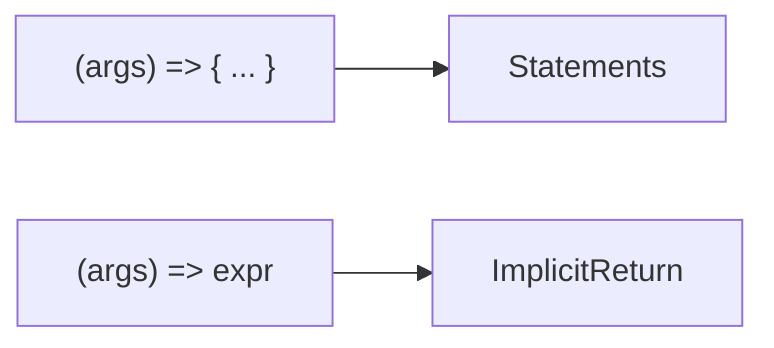

# Lesson 2: Arrow Functions

## Learning Objectives

By the end of this lesson, you will be able to:
- Explain the syntax options for arrow functions (block body vs implicit return)
- Correctly type arrow function parameters and return values
- Use arrows as callbacks with safe inference
- Understand the most important behavioral difference: **`this` binding**
- Recognize common arrow-function pitfalls (object literal returns, `this`, readability)

## What Are Arrow Functions?

Arrow functions are a more concise way to write functions. In TypeScript, they also work well with type inference—especially for callbacks.

### The two arrow “shapes”



## Basic Syntax

### Traditional function vs arrow

```typescript
// Traditional function declaration
function add(a: number, b: number): number {
  return a + b;
}

// Arrow function expression
const addArrow = (a: number, b: number): number => {
  return a + b;
};

// Arrow function with implicit return
const addOneLiner = (a: number, b: number): number => a + b;
```

### Parameter parentheses

In TypeScript, you’ll often keep parentheses for consistency:

```typescript
const double = (x: number): number => x * 2;
```

## Typing Arrow Functions

You can type:
- parameters
- return type
- or the whole function via a type alias

### Return type: inferred vs explicit

```typescript
// Inferred return type (number)
const triple = (x: number) => x * 3;

// Explicit return type (useful for public APIs)
const tripleExplicit = (x: number): number => x * 3;
```

### Typing the function value (recommended for reusable signatures)

```typescript
type StringMapper = (value: string) => string;

const trimAndLower: StringMapper = (value) => value.trim().toLowerCase();
```

## Arrow Functions with No Parameters

```typescript
const getMessage = (): string => "Hello, TypeScript!";
```

## Arrows as Callbacks (Where They Shine)

Most of the time, **you don’t need to annotate callback parameters** because TypeScript infers them from the function you’re calling.

```typescript
const numbers = [1, 2, 3, 4, 5];

const doubled = numbers.map((n) => n * 2);          // number[]
const evens = numbers.filter((n) => n % 2 === 0);   // number[]
const total = numbers.reduce((t, n) => t + n, 0);   // number
```

### Stronger inference with typed arrays/objects

```typescript
type User = { id: string; email: string; isActive: boolean };

const users: User[] = [
  { id: "u1", email: "a@example.com", isActive: true },
  { id: "u2", email: "b@example.com", isActive: false },
];

const activeEmails = users
  .filter((u) => u.isActive)
  .map((u) => u.email);
```

## The Big Difference: `this` Binding

Arrow functions **do not create their own `this`**. They capture `this` from the surrounding scope.

### Why this matters in classes

```typescript
class Counter {
  count = 0;

  // Arrow: `this` is always the instance
  increment = () => {
    this.count++;
  };

  // Method: `this` depends on how it's called
  incrementMethod() {
    this.count++;
  }
}

const c = new Counter();
const inc1 = c.increment;
inc1(); // works

const inc2 = c.incrementMethod;
// inc2(); // runtime error in JS unless bound (this is undefined)
```

### Practical rule

- Use **arrow properties** for event handlers and callbacks you pass around.
- Use **methods** for normal class behavior, but be mindful of binding.

## Common Pitfalls and Solutions

### Pitfall 1: Returning an object literal

**Problem:**

This returns `undefined` because `{}` is treated like a block body:

```typescript
// ❌ wrong (block body)
// const makeUser = (id: string) => { id };
```

**Solution:** Wrap the object literal in parentheses:

```typescript
// ✅ correct (wrap object literal in parentheses)
const makeUser = (id: string) => ({ id });
```

### Pitfall 2: Overusing arrows for long functions

**Problem:**

If the arrow becomes large, use a named function for clarity and stack traces:

```typescript
function calculateInvoiceTotal(/* ... */) {
  // ...
}
```

**Solution:** If the logic is long, prefer a named function (better readability and stack traces).

### Pitfall 3: Explicit types everywhere

**Problem:**

Over-annotating can add noise:

```typescript
// Too noisy for local usage
// const doubled: number[] = numbers.map((n: number): number => n * 2);
```

Prefer inference unless you’re defining a reusable API boundary.

## Arrow Functions and `arguments`

Arrow functions do **not** have their own `arguments` object.

```typescript
function demoArguments() {
  const regular = function () {
    return arguments.length;
  };

  const arrow = () => {
    // arguments; // ❌ Error in TS (and in JS it would refer to outer scope)
    return 0;
  };

  return { regularCount: regular(1, 2, 3), arrowCount: arrow() };
}
```

**Rule of thumb:**
- If you truly need `arguments`, use a regular function (or use rest parameters: `(...args) =>`).

## Arrow Functions and `new`

Arrow functions are **not constructable** — you can’t call them with `new`.

```typescript
const Person = (name: string) => ({ name });
// const p = new Person("Alice"); // ❌ Error
```

If you want “callable + constructable”, use a class or function declaration.

## Async Arrow Functions

Async arrows are common in real projects (fetching, DB calls, file IO).

```typescript
type User = { id: string; email: string };

const fetchUser = async (id: string): Promise<User> => {
  const res = await fetch(`/api/users/${id}`);
  if (!res.ok) throw new Error("Failed to fetch user");
  return (await res.json()) as User;
};
```

### Best practice: return `Promise<T>` explicitly at boundaries

For exported functions, explicit `Promise<T>` makes the contract obvious.

## Generic Arrow Functions (Common TS Gotcha)

You can write generics with arrow functions, but there’s a syntax quirk in TS/TSX.

```typescript
// Generic arrow function
const identity = <T,>(value: T): T => value;

const a = identity<number>(123);
const b = identity("hello"); // inferred string
```

The trailing comma `<T,>` helps avoid parsing ambiguity in TSX files.

## Arrow Functions in Objects

### Object method (has dynamic `this`)

```typescript
const counter = {
  count: 0,
  inc() {
    this.count += 1;
  },
};
```

### Object arrow property (captures outer `this`)

This is *usually not what you want* inside plain objects:

```typescript
const brokenCounter = {
  count: 0,
  // In a plain object literal, `this` is not the object here the way you might expect.
  inc: () => {
    // `this` is captured from outer scope, not `brokenCounter`.
  },
};
```

**Rule of thumb:**
- Use **methods** in object literals.
- Use **arrow properties** in classes when passing handlers around.

## Real-World Scenario: React / Next.js Event Handlers

In React, you often pass callbacks down as props or into event handlers.

```typescript
type ButtonProps = {
  label: string;
  onClick: () => void;
};

function Button({ label, onClick }: ButtonProps) {
  return <button onClick={onClick}>{label}</button>;
}

// Usage:
// <Button label="Save" onClick={() => saveDraft()} />
```

Key ideas:
- The callback type (`() => void`) prevents passing invalid handlers.
- Arrow functions are convenient for inline callbacks, but keep them short.

## Best Practices Checklist

- **Prefer inference for callbacks**: `array.map(x => ...)` is usually enough.
- **Annotate exported function values** (especially shared utilities).
- **Avoid huge inline arrows**: if it takes more than ~5–10 lines, name it.
- **Be careful with `this`**: arrows capture; methods bind at call time.
- **Use rest parameters** instead of relying on `arguments`.

## Troubleshooting

### Issue: "Cannot read properties of undefined (reading 'count')"

**Symptoms:**
- A class method is passed as a callback and throws at runtime when called.

**Solutions:**
1. Use an arrow property so `this` is captured:
   ```typescript
   class Counter {
     count = 0;
     increment = () => { this.count++; };
   }
   ```
2. Or bind the method:
   ```typescript
   const bound = c.incrementMethod.bind(c);
   bound();
   ```

```typescript
const bound = c.incrementMethod.bind(c);
bound();
```

## Next Steps

Now that you understand arrow functions:

1. ✅ **Practice**: Convert 3 function declarations to arrows (and keep types correct)
2. ✅ **Experiment**: Create a `this` bug using a method, then fix it with an arrow property
3. 📖 **Next Lesson**: Learn about [Conditionals and Loops](./lesson-03-conditionals-loops.md)
4. 💻 **Complete Exercises**: Work through [Exercises 02](./exercises-02.md)

## Additional Resources

- [TypeScript Handbook: More on Functions](https://www.typescriptlang.org/docs/handbook/2/functions.html)
- [TypeScript Handbook: Classes](https://www.typescriptlang.org/docs/handbook/2/classes.html)

---

**Key Takeaways:**
- Arrow functions are concise function expressions.
- Expression bodies implicitly return; block bodies require `return`.
- Callback parameter types are usually inferred—avoid over-annotating locally.
- Arrow functions capture `this`; methods depend on how they’re called.
- Use arrow properties in classes for handlers you pass around.
- Don’t use arrows for object-literal methods when you need dynamic `this`.
- Arrows don’t have their own `arguments`; prefer rest parameters.
- Arrows can’t be used with `new`.
- Async arrows return `Promise<T>`; annotate boundaries for clarity.
- Generic arrows may use `<T,>` in TSX to avoid parsing ambiguity.
