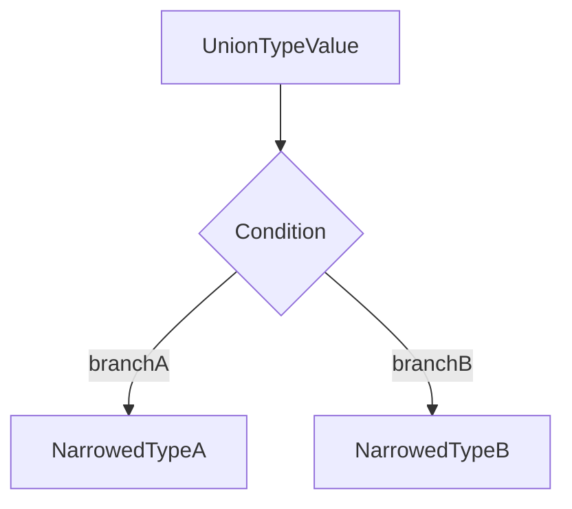

# Lesson 3: Conditionals and Loops

## Learning Objectives

By the end of this lesson, you will be able to:
- Use `if/else`, ternaries, and `switch` with safe typing
- Understand **type narrowing** and why it’s one of TypeScript’s superpowers
- Choose the right looping tool (`for`, `for...of`, `for...in`, `while`)
- Use common array methods (`map`, `filter`, `reduce`) with correct inference
- Avoid common pitfalls (truthiness narrowing, `for...in` on arrays, unreachable cases)

## Why This Matters

Control flow is where TypeScript can *prove* types.



## `if/else` and Type Narrowing

TypeScript conditionals work like JavaScript, but they also narrow union types.

```typescript
function processValue(value: string | number) {
  if (typeof value === "string") {
    // value: string
    console.log(value.toUpperCase());
  } else {
    // value: number
    console.log(value.toFixed(2));
  }
}
```

### Common narrowing tools

- `typeof` for primitives (`string`, `number`, `boolean`, `bigint`, `symbol`, `undefined`)
- `instanceof` for classes
- property checks like `"prop" in obj`
- equality checks (`value === null`)

```typescript
function describe(input: Date | string) {
  if (input instanceof Date) {
    return input.toISOString();
  }
  return input.trim();
}
```

## More Depth: Discriminated Unions + Exhaustive `switch`

Discriminated unions are one of the cleanest ways to model “one of several shapes”.

```typescript
type ApiResult =
  | { type: "success"; data: { id: string; name: string } }
  | { type: "error"; errorCode: "NOT_FOUND" | "UNAUTHORIZED" };

function renderResult(result: ApiResult): string {
  switch (result.type) {
    case "success":
      return `User: ${result.data.name}`;
    case "error":
      return `Error: ${result.errorCode}`;
  }
}
```

### Add a `never` exhaustive check (Level-1 style safety)

```typescript
function assertNever(value: never): never {
  throw new Error(`Unexpected value: ${JSON.stringify(value)}`);
}

function renderResultStrict(result: ApiResult): string {
  switch (result.type) {
    case "success":
      return `User: ${result.data.name}`;
    case "error":
      return `Error: ${result.errorCode}`;
    default:
      return assertNever(result);
  }
}
```

This way, if you later add a new union member, TypeScript forces you to update the `switch`.

## Truthiness Checks (Be Careful)

Truthiness narrowing is convenient, but it can hide valid values like `0` or `""`.

```typescript
function printScore(score?: number) {
  // ❌ If score is 0, this is treated as "false"
  if (score) console.log("Score:", score);
}
```

Prefer explicit checks:

```typescript
function printScoreSafe(score?: number) {
  if (score !== undefined) console.log("Score:", score);
}
```

## More Depth: `null` vs `undefined` and `??`

`??` (nullish coalescing) treats only `null` and `undefined` as “missing”.

```typescript
function formatLabel(label?: string | null) {
  // If label is "" (empty string), it will be kept (not replaced).
  return label ?? "Untitled";
}
```

## More Depth: Guard Clauses (Readable Control Flow)

Guard clauses reduce nesting and often read more clearly.

```typescript
type User = { id: string; email: string; isActive: boolean };

function canLogin(user: User): boolean {
  if (!user.isActive) return false;
  if (user.email.trim().length === 0) return false;
  return true;
}
```

## Ternary Operator

Use ternaries for small, readable decisions.

```typescript
const age = 20;
const status = age >= 18 ? "adult" : "minor";
```

### Tip: prefer literal unions

```typescript
type UserStatus = "adult" | "minor";
const status2: UserStatus = age >= 18 ? "adult" : "minor";
```

## `switch` Statements

`switch` is great when you have many discrete cases. In TypeScript, it can also pair nicely with **literal unions**.

```typescript
function getDayName(day: number): string {
  switch (day) {
    case 0:
      return "Sunday";
    case 1:
      return "Monday";
    case 2:
      return "Tuesday";
    default:
      return "Unknown";
  }
}
```

### Better: use a union for valid values

```typescript
type Day = 0 | 1 | 2;

function getDayNameSafe(day: Day): string {
  switch (day) {
    case 0:
      return "Sunday";
    case 1:
      return "Monday";
    case 2:
      return "Tuesday";
  }
}
```

## More Depth: Iterating Objects Safely

### Prefer `Object.entries()` with a typed helper

This avoids the common `for...in` indexing pain.

```typescript
function typedEntries<T extends object>(obj: T): Array<[keyof T, T[keyof T]]> {
  return Object.entries(obj) as Array<[keyof T, T[keyof T]]>;
}

const person = { name: "Alice", age: 25 };

for (const [key, value] of typedEntries(person)) {
  // key: "name" | "age"
  // value: string | number
  console.log(key, value);
}
```

## Loops

### `for` loop (index-based)

```typescript
for (let i = 0; i < 5; i++) {
  console.log(i);
}
```

Use it when you need:
- indices
- stepping patterns
- early break/continue

### `for...of` (values from iterables)

This is usually the best loop for arrays.

```typescript
const numbers = [1, 2, 3, 4, 5];
for (const num of numbers) {
  console.log(num);
}
```

### Loop control: `break` and `continue`

```typescript
for (const n of [1, 2, 3, 4, 5]) {
  if (n === 3) continue; // skip 3
  if (n === 5) break;    // stop at 5
  console.log(n);
}
```

### `for...in` (keys of objects)

Use with objects, not arrays.

```typescript
const person = { name: "Alice", age: 25 };
for (const key in person) {
  // key: string (in JS), so we narrow using keyof
  const typedKey = key as keyof typeof person;
  console.log(typedKey, person[typedKey]);
}
```

#### Common mistake: `for...in` on arrays

`for...in` yields string keys like `"0"`, `"1"`, not values.

## `while` Loops

Use `while` when you don’t know how many iterations you need.

```typescript
let count = 0;
while (count < 5) {
  console.log(count);
  count++;
}
```

## More Depth: Async Loops (and a common trap)

### Don’t use `forEach` with `async`

`forEach` won’t await your async callback.

```typescript
async function bad() {
  [1, 2, 3].forEach(async (n) => {
    await Promise.resolve();
    console.log(n);
  });
}
```

Prefer `for...of`:

```typescript
async function good() {
  for (const n of [1, 2, 3]) {
    await Promise.resolve();
    console.log(n);
  }
}
```

## Array Methods (Functional Approach)

Array methods are often clearer than loops—and TypeScript infers types very well here.

```typescript
const numbers = [1, 2, 3, 4, 5];

numbers.forEach((num) => console.log(num));

const doubled = numbers.map((num) => num * 2);
const evens = numbers.filter((num) => num % 2 === 0);
const sum = numbers.reduce((total, num) => total + num, 0);
```

### `reduce` pitfall: missing initial value

Without an initial value, reduce can become harder to type and can throw for empty arrays.

```typescript
const sumSafe = numbers.reduce((t, n) => t + n, 0);
```

## Real-World Scenario: Filtering and Transforming API Data

You often take an array of unknown-ish objects and transform them into a safe format for rendering.

```typescript
type ApiUser = { id: string; email?: string | null; isActive: boolean };

function getActiveEmails(users: ApiUser[]): string[] {
  return users
    .filter((u) => u.isActive)
    .map((u) => u.email ?? "")
    .filter((email) => email.length > 0);
}
```

## Common Pitfalls and Solutions

### Pitfall 1: Using truthiness when `0` is valid

**Problem:**

```typescript
function printScore(score?: number) {
  // ❌ If score is 0, this branch will be skipped
  if (score) console.log(score);
}
```

**Solution:**

```typescript
function printScoreSafe(score?: number) {
  if (score !== undefined) console.log(score);
}
```

Use `!== undefined` or `!= null` depending on what you mean.

### Pitfall 2: `for...in` over arrays

**Problem:**
`for...in` iterates keys (`"0"`, `"1"`, ...) not values.

**Solution:**
Use `for...of` (values) or a classic `for` (indices):

```typescript
for (const value of [10, 20, 30]) {
  console.log(value);
}
```

Prefer `for...of`, `forEach`, or indexed `for`.

### Pitfall 3: `switch` without covering cases

**Problem:**
Missing cases can lead to unexpected runtime behavior when new union members are added.

**Solution:**
Use discriminated unions + exhaustive checks (`never`) so TypeScript forces updates.

Use literal unions + exhaustive switches when possible.

## Troubleshooting

### Issue: "Object is possibly 'undefined'"

**Symptoms:**
- You get an error when calling a method or accessing a property on an optional value.

**Solutions:**
1. Narrow before use:
   ```typescript
   if (value !== undefined) {
     // safe
   }
   ```
2. Use `??` to provide a fallback when appropriate.

```typescript
if (value !== undefined) {
  // safe
}
```

### Issue: "Element implicitly has an 'any' type because expression of type 'string' can't be used to index type ..."

**Symptoms:**
- You index an object with a string key and TS complains you might be accessing an invalid property.

**Solutions:**
1. Use `keyof` typing:
   ```typescript
   const person = { name: "Alice", age: 25 };
   const key = "name" as keyof typeof person;
   console.log(person[key]);
   ```
2. Prefer `Object.entries()` with a typed helper when iterating objects.

## Next Steps

Now that you understand control flow and narrowing:

1. ✅ **Practice**: Convert one nested `if/else` chain into a discriminated-union `switch`
2. ✅ **Practice**: Rewrite one `for` loop as `map/filter/reduce`
3. 💻 **Complete Exercises**: Work through [Exercises 02](./exercises-02.md)
4. 📖 **Next Level**: Move to [Objects and Arrays](../level-03-objects-and-arrays/lesson-01-objects.md)

## Additional Resources

- [TypeScript Handbook: Narrowing](https://www.typescriptlang.org/docs/handbook/2/narrowing.html)
- [TypeScript Handbook: Everyday Types](https://www.typescriptlang.org/docs/handbook/2/everyday-types.html)

---

**Key Takeaways:**
- Conditionals drive TypeScript’s type narrowing.
- Prefer explicit checks (`!== undefined`, `??`) over truthiness when `0`/`""` are valid.
- `switch` pairs well with literal unions; exhaustive checks catch missing cases.
- Prefer `for...of` for arrays; use `for...in` for object keys (carefully).
- `map/filter/reduce` are often clearer than loops and TypeScript infers types well.
- Always provide a `reduce` initial value for safety and better typing.
- Don’t use `forEach(async ...)`; use `for...of` when you need `await`.
- Use typed helpers (`keyof`, typed entries) to avoid unsafe object indexing.
