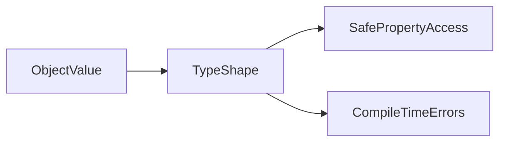

# Lesson 1: Objects

## Learning Objectives

By the end of this lesson, you will be able to:
- Define **object shapes** safely in TypeScript
- Use **type aliases** to avoid repeating inline object types
- Work with **optional** and **readonly** properties (and understand what they do and don’t guarantee)
- Model **nested objects** and update them safely
- Recognize common pitfalls (excess property checks, optional + truthiness, accidental mutation)

## Why Objects Matter in TypeScript

Most real applications are built around objects:
- API responses (JSON objects)
- config objects
- domain models (User, Order, Product)

TypeScript helps you describe the **shape** of those objects so:
- you get autocomplete and documentation
- refactors are safer
- you catch “missing field / wrong type” issues early

#### Visual: object shape as a contract



## Object Types (Inline)

TypeScript can type an object inline:

```typescript
const person: { name: string; age: number } = {
  name: "Alice",
  age: 25,
};
```

This is fine for quick examples, but it becomes hard to maintain as shapes grow.

## Prefer Type Aliases for Reuse

Use a type alias so you don’t repeat the same shape:

```typescript
type Person = {
  name: string;
  age: number;
};

const alice: Person = { name: "Alice", age: 25 };
```

Benefits:
- more readable
- easier refactors (one place to change)
- the name communicates intent (`Person` vs `{ name: string; age: number }`)

## Object Properties (Read/Write)

```typescript
const person = { name: "Alice", age: 25 };

console.log(person.name); // "Alice"
person.age = 26;          // OK (age is number)
```

TypeScript enforces correct assignments:

```typescript
// person.age = "26"; // ❌ Error: Type 'string' is not assignable to type 'number'
```

## Optional Properties

Optional properties are marked with `?` and can be missing.

```typescript
type Person = {
  name: string;
  age?: number; // optional
};

const p1: Person = { name: "Alice" };
const p2: Person = { name: "Bob", age: 25 };
```

### Important: Optional means “could be undefined”

```typescript
function formatAge(person: Person): string {
  // person.age could be undefined
  return person.age !== undefined ? String(person.age) : "unknown";
}
```

## Readonly Properties

`readonly` prevents reassignment through that type.

```typescript
type Config = {
  readonly apiKey: string;
  timeout: number;
};

const config: Config = { apiKey: "abc123", timeout: 5000 };

// config.apiKey = "new"; // ❌ Error: Cannot assign to 'apiKey' because it is a read-only property
config.timeout = 10000;   // ✅ OK
```

### `readonly` is not deep immutability

If a readonly property is itself an object, its inner properties may still be mutable unless you make *them* readonly too.

## Nested Objects

```typescript
type Address = {
  street: string;
  city: string;
};

type User = {
  name: string;
  address: Address;
};

const user: User = {
  name: "Alice",
  address: { street: "123 Main St", city: "New York" },
};
```

### Updating nested objects safely (spread)

```typescript
const updatedUser: User = {
  ...user,
  address: {
    ...user.address,
    city: "Boston",
  },
};
```

This pattern avoids accidental mutation (important in React state).

## Excess Property Checks (Common “Why is TS yelling?” moment)

TypeScript is stricter for **object literals** assigned to a type:

```typescript
type Person = { name: string; age: number };

// ❌ Error: Object literal may only specify known properties
// const p: Person = { name: "Alice", age: 25, role: "admin" };
```

### Why this is good

It catches typos:

```typescript
type Person = { name: string };
// const p: Person = { name: "Alice", nmae: "typo" }; // ❌ caught
```

## Best Practices

### 1) Use type aliases for common shapes

Keep object shapes named and reusable.

### 2) Prefer `const` for objects you don’t intend to reassign

```typescript
const settings = { theme: "dark" };
```

### 3) Treat optional properties as possibly undefined

Use explicit checks (`!== undefined`) or nullish coalescing (`??`) where appropriate.

## Common Pitfalls and Solutions

### Pitfall 1: Optional property + truthiness checks

**Problem:**

```typescript
type Person = { age?: number };

function isAdult(p: Person) {
  // If age is 0, this is false (even though it's a valid number)
  return p.age ? p.age >= 18 : false;
}
```

**Solution:**

```typescript
function isAdultSafe(p: Person) {
  return p.age !== undefined ? p.age >= 18 : false;
}
```

### Pitfall 2: Mutating objects unexpectedly

**Problem:**

```typescript
const user = { name: "Alice", address: { city: "NYC" } };
const alias = user;
alias.address.city = "Boston"; // also changed user.address.city
```

**Solution:** Use immutable updates (spread) when you need new values.

## Troubleshooting

### Issue: "Object literal may only specify known properties"

**Symptoms:**
- TypeScript complains when you add an extra property to an object literal.

**Solutions:**
1. Fix typos or remove unexpected fields.
2. If the object really has more fields, update the type to include them.
3. If you need flexible keys, consider an index signature (advanced topic).

### Issue: "Property 'x' does not exist on type ..."

**Symptoms:**
- You try to access a property that isn’t in the type shape.

**Solutions:**
1. Confirm the property exists on the type (update the type if needed).
2. If the value is optional, check it before use.

## Next Steps

Now that you understand object typing:

1. ✅ **Practice**: Define a `User` type and create 3 valid objects
2. ✅ **Experiment**: Add an extra property and see how excess property checks work
3. 📖 **Next Lesson**: Learn about [Arrays](./lesson-02-arrays.md)
4. 💻 **Complete Exercises**: Work through [Exercises 03](./exercises-03.md)

## Additional Resources

- [TypeScript Handbook: Object Types](https://www.typescriptlang.org/docs/handbook/2/objects.html)
- [TypeScript Handbook: Everyday Types](https://www.typescriptlang.org/docs/handbook/2/everyday-types.html)

---

**Key Takeaways:**
- Objects in TypeScript have **shapes** (property names + types).
- Prefer **type aliases** over repeating inline object types.
- Optional properties (`?`) mean the property may be missing (`undefined`).
- `readonly` prevents reassignment through the type, but it’s not always deep immutability.
- Use spread (`{ ...obj }`) for safe, immutable-style updates.
- Excess property checks help catch typos and unintended fields early.
