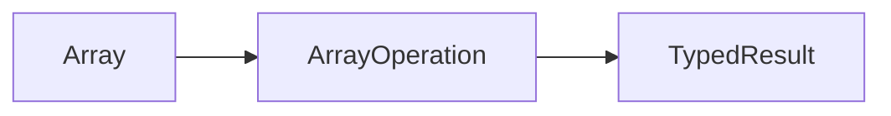

# Lesson 2: Arrays

## Learning Objectives

By the end of this lesson, you will be able to:
- Declare typed arrays (`T[]` and `Array<T>`) and understand when each is used
- Read, update, and iterate arrays safely
- Use `readonly` arrays to prevent mutation
- Use tuple types for fixed-length, position-typed arrays
- Use destructuring (including rest) confidently
- Recognize common pitfalls (out-of-bounds access, readonly mutation, tuple confusion)

## Why Arrays Matter in TypeScript

Arrays are the most common collection type in JS/TS:
- API lists (users, posts, products)
- UI rendering (map over items)
- aggregation (reduce to totals)

TypeScript helps by keeping element types consistent and preventing “string in number array” bugs.



## Array Types

TypeScript arrays are typed:

```typescript
const numbers: number[] = [1, 2, 3, 4, 5];
const names: string[] = ["Alice", "Bob", "Charlie"];

// Alternative generic syntax
const numbers2: Array<number> = [1, 2, 3];
```

### Which syntax should you use?

- Prefer `T[]` for readability (`number[]`, `User[]`)
- Use `Array<T>` when you need nested generics (`Array<Record<string, number>>`)

## Array Operations (Mutating vs Non-Mutating)

```typescript
const numbers = [1, 2, 3];

// Access elements
console.log(numbers[0]); // 1

// Modify elements
numbers[0] = 10;

// Add elements
numbers.push(4);
numbers.unshift(0);

// Remove elements
numbers.pop();
numbers.shift();
```

### Mutation is sometimes fine, sometimes not

- In scripts/utilities, mutation is often okay
- In React state, prefer non-mutating patterns (`map`, `filter`, spread)

## Readonly Arrays

Readonly arrays prevent mutation methods like `push`, `pop`, etc.

```typescript
const readonlyNumbers: readonly number[] = [1, 2, 3];

// readonlyNumbers.push(4); // ❌ Error
```

### Note: `readonly` is shallow

If the array contains objects, you can still mutate the objects unless they’re typed readonly too.

## Tuple Types

Tuples are fixed-length arrays with specific types at each position:

```typescript
const point: [number, number] = [10, 20];
const person: [string, number, boolean] = ["Alice", 25, true];

const x = point[0]; // number
const y = point[1]; // number
```

### When tuples are useful

- coordinates (`[lat, lng]`)
- returning multiple values (`[value, error]`)
- modeling a pair (`[id, entity]`)

### Prefer objects when meaning matters

If positions are confusing, use an object instead:

```typescript
type Point = { x: number; y: number };
```

## Array Destructuring

```typescript
const numbers = [1, 2, 3];
const [first, second, third] = numbers;

const [head, ...tail] = numbers; // head: 1, tail: [2, 3]
```

### Destructuring tuples

```typescript
const coords: [number, number] = [40.7, -74.0];
const [lat, lng] = coords;
```

## Real-World Scenario: Rendering a List Safely

```typescript
type User = { id: string; email: string };

const users: User[] = [
  { id: "u1", email: "a@example.com" },
  { id: "u2", email: "b@example.com" },
];

const emails = users.map((u) => u.email); // string[]
```

TypeScript prevents:
- missing properties
- wrong element types
- accidental mixing of data shapes

## Best Practices

### 1) Prefer non-mutating array methods for transformations

- `map` for transform
- `filter` for selection
- `reduce` for aggregation

### 2) Use `readonly` at boundaries when you want to guarantee “no mutation”

```typescript
function printNumbers(values: readonly number[]) {
  values.forEach(console.log);
}
```

### 3) Be careful with indexing

Indexing can return `undefined` at runtime. Don’t assume an element exists unless you checked.

## Common Pitfalls and Solutions

### Pitfall 1: Out-of-bounds access

**Problem:**

```typescript
const nums: number[] = [];
const first = nums[0]; // undefined at runtime
```

**Solution:**

```typescript
const firstSafe = nums.length > 0 ? nums[0] : undefined;
```

### Pitfall 2: Confusing tuples and arrays

**Problem:**

```typescript
const point: [number, number] = [10, 20];
// point[2] = 30; // ❌ not valid shape
```

**Solution:** Use tuples only when the length and positions are fixed and meaningful.

### Pitfall 3: Trying to mutate a readonly array

**Problem:**

```typescript
const xs: readonly number[] = [1, 2, 3];
// xs.push(4); // ❌
```

**Solution:** Create a new array:

```typescript
const ys = [...xs, 4];
```

## Troubleshooting

### Issue: "Property 'push' does not exist on type 'readonly ...[]'"

**Symptoms:**
- You call mutating methods (`push`, `pop`, `splice`) on a readonly array.

**Solutions:**
1. If mutation is intended, change the type to mutable (`number[]`).
2. If immutability is intended, create a new array with spread or `concat`.

### Issue: "Type 'string' is not assignable to type 'number'"

**Symptoms:**
- You accidentally add the wrong element type into an array.

**Solutions:**
1. Fix the value to match the array element type.
2. If the array truly can contain multiple types, use a union (`(string | number)[]`) and narrow when using values.

## Next Steps

Now that you understand arrays and tuples:

1. ✅ **Practice**: Create a `User[]` and transform it into an `email[]`
2. ✅ **Experiment**: Convert a mutable array workflow into an immutable one
3. 📖 **Next Lesson**: Learn about [Array Methods](./lesson-03-array-methods.md)
4. 💻 **Complete Exercises**: Work through [Exercises 03](./exercises-03.md)

## Additional Resources

- [TypeScript Handbook: Arrays](https://www.typescriptlang.org/docs/handbook/2/everyday-types.html#arrays)
- [TypeScript Handbook: Tuples](https://www.typescriptlang.org/docs/handbook/2/objects.html#tuple-types)

---

**Key Takeaways:**
- Arrays are typed collections: `T[]` or `Array<T>`.
- Prefer `T[]` for readability; use `Array<T>` for complex generics.
- Readonly arrays prevent mutation but are shallow (objects inside can still be mutable).
- Tuples model fixed-length, position-typed arrays.
- Prefer array methods (`map/filter/reduce`) for transformations.
- Don’t assume indexed access exists—arrays can be empty at runtime.
