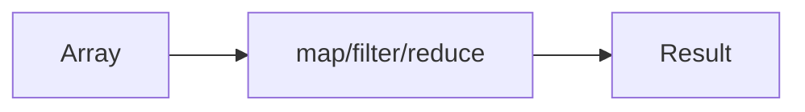

# Lesson 3: Array Methods

## Learning Objectives

By the end of this lesson, you will be able to:
- Choose the right array method for a task (`forEach`, `map`, `filter`, `reduce`, `find`, `some`, `every`)
- Understand the difference between **transforming** vs **mutating**
- Use TypeScript inference in callbacks effectively
- Avoid common pitfalls (`reduce` initial value, `filter` not narrowing, `sort` mutating)
- Apply array methods to real-world scenarios (API transformation and UI rendering)

## Why Array Methods Matter

Array methods help you write code that is:
- readable (express intent: map/filter/reduce)
- less error-prone than manual loops (in many cases)
- very TypeScript-friendly (excellent type inference)



## `forEach` (Do something for each item)

Use `forEach` for side effects (logging, updating an external variable).

```typescript
const numbers = [1, 2, 3, 4, 5];

numbers.forEach((num) => {
  console.log(num);
});
```

### Best practice

If you want a new array, use `map` (not `forEach`).

## `map` (Transform into a new array)

```typescript
const numbers = [1, 2, 3, 4, 5];
const doubled = numbers.map((num) => num * 2);
// [2, 4, 6, 8, 10]
```

TypeScript infers the output type automatically:

```typescript
const strings = numbers.map((num) => num.toString()); // string[]
```

## `filter` (Select a subset)

```typescript
const numbers = [1, 2, 3, 4, 5];
const evens = numbers.filter((num) => num % 2 === 0);
// [2, 4]
```

### Filtering with type guards (important for narrowing)

If you filter out `null`/`undefined`, TypeScript may not automatically narrow unless you use a type guard:

```typescript
const values: Array<string | null> = ["a", null, "b"];

function isString(value: string | null): value is string {
  return value !== null;
}

const onlyStrings = values.filter(isString); // string[]
```

## `reduce` (Accumulate into a single value)

```typescript
const numbers = [1, 2, 3, 4, 5];
const sum = numbers.reduce((total, num) => total + num, 0);
// 15
```

### Reduce can return *any* shape

```typescript
type CountByParity = { even: number; odd: number };

const counts = numbers.reduce<CountByParity>(
  (acc, n) => {
    if (n % 2 === 0) acc.even += 1;
    else acc.odd += 1;
    return acc;
  },
  { even: 0, odd: 0 }
);
```

## `find` (First matching item)

```typescript
const users = [
  { id: 1, name: "Alice" },
  { id: 2, name: "Bob" },
];

const user = users.find((u) => u.id === 2);
// { id: 2, name: "Bob" } | undefined
```

### Important: `find` can return `undefined`

Always handle that possibility:

```typescript
if (!user) {
  throw new Error("User not found");
}
```

## `some` and `every` (Boolean checks)

```typescript
const numbers = [1, 2, 3, 4, 5];

const hasEven = numbers.some((num) => num % 2 === 0); // true
const allPositive = numbers.every((num) => num > 0);  // true
```

## Bonus: `sort` (Mutates!)

`sort()` modifies the original array (common surprise).

```typescript
const nums = [3, 1, 2];
const sorted = [...nums].sort((a, b) => a - b); // copy first
// nums is unchanged, sorted is [1, 2, 3]
```

## Real-World Scenario: Transforming API Data

Imagine an API returns this shape:

```typescript
type ApiUser = {
  id: string;
  email?: string | null;
  isActive: boolean;
};
```

You want a clean list of active emails:

```typescript
function getActiveEmails(users: ApiUser[]): string[] {
  return users
    .filter((u) => u.isActive)
    .map((u) => u.email ?? "")
    .filter((email) => email.length > 0);
}
```

## Best Practices

### 1) Prefer chaining for clear “pipeline” transformations

```typescript
const result = items
  .filter(/* ... */)
  .map(/* ... */);
```

### 2) Always give `reduce` an initial value

It prevents runtime errors on empty arrays and improves typing.

### 3) Avoid async `forEach`

If you need `await`, use `for...of` instead of `forEach`.

## Common Pitfalls and Solutions

### Pitfall 1: Using `forEach` when you meant `map`

**Problem:**

```typescript
const out: number[] = [];
[1, 2, 3].forEach((n) => out.push(n * 2));
```

**Solution:**

```typescript
const out = [1, 2, 3].map((n) => n * 2);
```

### Pitfall 2: `reduce` without an initial value

**Problem:**

```typescript
const empty: number[] = [];
// empty.reduce((t, n) => t + n); // ❌ throws at runtime
```

**Solution:**

```typescript
const safe = empty.reduce((t, n) => t + n, 0);
```

### Pitfall 3: `sort` mutates the original array

**Problem:**

```typescript
const a = [3, 1, 2];
a.sort(); // mutates a
```

**Solution:**

```typescript
const sorted = [...a].sort();
```

## Troubleshooting

### Issue: "Object is possibly 'undefined'" after `find`

**Symptoms:**
- TypeScript complains because `find` may return `undefined`.

**Solutions:**
1. Add a check:
   ```typescript
   const u = users.find((x) => x.id === "2");
   if (!u) throw new Error("Not found");
   ```
2. Provide a fallback if appropriate.

### Issue: Filter didn't narrow the type

**Symptoms:**
- After filtering, TypeScript still thinks values might be `null`/`undefined`.

**Solutions:**
1. Use a type guard predicate (`value is T`) in your filter function.
2. Or use a dedicated helper like `isDefined`.

## Next Steps

Now that you understand array methods:

1. ✅ **Practice**: Transform a list of objects into a list of strings with `map`
2. ✅ **Experiment**: Replace a loop with `filter + map + reduce`
3. 📖 **Next Level**: Continue to the next level in the TypeScript course
4. 💻 **Complete Exercises**: Work through [Exercises 03](./exercises-03.md)

## Additional Resources

- [MDN: Array.prototype.map](https://developer.mozilla.org/en-US/docs/Web/JavaScript/Reference/Global_Objects/Array/map)
- [MDN: Array.prototype.filter](https://developer.mozilla.org/en-US/docs/Web/JavaScript/Reference/Global_Objects/Array/filter)
- [MDN: Array.prototype.reduce](https://developer.mozilla.org/en-US/docs/Web/JavaScript/Reference/Global_Objects/Array/reduce)
- [TypeScript Handbook: Narrowing](https://www.typescriptlang.org/docs/handbook/2/narrowing.html)

---

**Key Takeaways:**
- Use `forEach` for side effects, `map` for transformations, `filter` for selection.
- `reduce` aggregates into any shape—always provide an initial value.
- `find` can return `undefined`; handle it explicitly.
- `some`/`every` are great for boolean checks.
- `sort` mutates—copy first if you need immutability.
- Type guards in `filter` help TypeScript narrow types safely.
