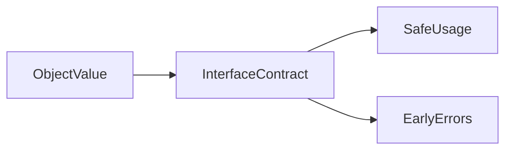

# Lesson 1: Interfaces

## Learning Objectives

By the end of this lesson, you will be able to:
- Define object shapes with `interface`
- Use optional (`?`) and `readonly` properties correctly
- Extend interfaces with `extends` (and understand what that means)
- Understand **declaration merging** (why it exists and how it can surprise you)
- Decide when to use an **interface vs a type alias**
- Recognize common pitfalls (optional values, excess property checks, shallow readonly)

## Why Interfaces Matter

Interfaces are one of TypeScript’s best tools for:
- describing the **shape** of objects (especially API/domain models)
- creating stable contracts for functions/modules
- enabling better autocomplete and safer refactors

They’re extremely common in real codebases because they’re readable and extensible.



## Interface Definition

Interfaces define the shape of objects:

```typescript
interface Person {
  name: string;
  age: number;
}

const person: Person = {
  name: "Alice",
  age: 25,
};
```

### Why this is useful

- If you miss a property, TypeScript tells you.
- If you add the wrong type, TypeScript tells you.

## Optional Properties

Optional properties use `?` and may be missing (or `undefined`).

```typescript
interface User {
  name: string;
  email: string;
  age?: number;
}

const u1: User = { name: "Alice", email: "a@example.com" };
const u2: User = { name: "Bob", email: "b@example.com", age: 25 };
```

### Important: Optional means “possibly undefined”

```typescript
function formatAge(user: User): string {
  return user.age !== undefined ? `${user.age}` : "unknown";
}
```

## Readonly Properties

`readonly` prevents reassignment through that interface.

```typescript
interface Config {
  readonly apiKey: string;
  timeout: number;
}

const config: Config = { apiKey: "abc123", timeout: 5000 };

// config.apiKey = "new"; // ❌ Error
config.timeout = 8000;     // ✅ OK
```

### Readonly is shallow

If the property is an object, the object’s internal fields are not automatically readonly.

## Extending Interfaces

Interfaces can extend other interfaces.

```typescript
interface Animal {
  name: string;
}

interface Dog extends Animal {
  breed: string;
}

const myDog: Dog = {
  name: "Buddy",
  breed: "Golden Retriever",
};
```

This is how you build larger models from smaller ones.

## Interfaces for Function Shapes (Call Signatures)

Interfaces can describe callable “function-like” values:

```typescript
interface Formatter {
  (value: number): string;
  unit: string;
}

const seconds: Formatter = Object.assign(
  (value: number) => `${value}s`,
  { unit: "seconds" }
);

seconds(5);       // "5s"
seconds.unit;     // "seconds"
```

## Interfaces for Indexable Types (Index Signatures)

When you have objects with dynamic keys:

```typescript
interface StringNumberMap {
  [key: string]: number;
}

const scores: StringNumberMap = {
  Alice: 95,
  Bob: 87,
};
```

Use this carefully—index signatures make object shapes more flexible (but also less strict).

## Interface vs Type Alias (When to Use Which)

Both can represent object shapes. The main differences:

- **Interfaces**:
  - can be extended with `extends`
  - can **merge** (declaration merging)
  - are often preferred for public object shapes (teams/frameworks)

- **Type aliases**:
  - can represent unions/intersections more naturally
  - are often preferred for complex type logic (`|`, `&`, mapped/conditional types)

### Example: both can model the same shape

```typescript
interface PersonI {
  name: string;
}

type PersonT = {
  name: string;
};
```

## Declaration Merging (Important)

Interfaces can merge if declared multiple times with the same name.

```typescript
interface Window {
  myAppVersion: string;
}

interface Window {
  myAppBuild: string;
}

// Window now has BOTH properties in its type
```

This is useful for augmenting global types, but can surprise you if done accidentally.

## Best Practices

### 1) Use interfaces for stable object contracts

For models like `User`, `Product`, `Config`, interfaces are usually a good choice.

### 2) Keep interfaces small and composable

Prefer smaller interfaces that you combine using `extends`.

### 3) Treat optional properties as possibly undefined

Always narrow (`!== undefined`) or provide defaults (`??`) before use.

## Common Pitfalls and Solutions

### Pitfall 1: Assuming optional means “always present later”

**Problem:**

```typescript
interface User {
  age?: number;
}

function printAge(user: User) {
  // user.age might still be undefined
  // console.log(user.age.toFixed(0)); // ❌
}
```

**Solution:**

```typescript
function printAgeSafe(user: User) {
  if (user.age !== undefined) {
    console.log(user.age.toFixed(0));
  }
}
```

### Pitfall 2: Readonly does not freeze objects

**Problem:**
Readonly prevents reassignment, not deep mutation.

**Solution:**
Use immutable updates (spread) and/or deep readonly types (advanced).

## Troubleshooting

### Issue: "Property 'x' is missing in type ..."

**Symptoms:**
- TypeScript error when assigning an object that doesn’t include all required fields.

**Solutions:**
1. Add the missing property.
2. If it should be optional, mark it optional with `?`.

### Issue: "Object literal may only specify known properties"

**Symptoms:**
- Error when you add an extra property to an object literal.

**Solutions:**
1. Fix typos / remove unexpected fields.
2. Update the interface if that property really exists.

### Issue: "Cannot assign to 'x' because it is a read-only property"

**Symptoms:**
- You try to reassign a readonly property.

**Solutions:**
1. Re-check whether the property should be readonly.
2. Create a new object instead of mutating the old one.

## Next Steps

Now that you understand interfaces:

1. ✅ **Practice**: Create `User`, `Admin`, and `Guest` interfaces and extend where appropriate
2. ✅ **Experiment**: Try making properties optional and observe how narrowing works
3. 📖 **Next Lesson**: Learn about [Type Aliases](./lesson-02-type-aliases.md)
4. 💻 **Complete Exercises**: Work through [Exercises 04](./exercises-04.md)

## Additional Resources

- [TypeScript Handbook: Object Types](https://www.typescriptlang.org/docs/handbook/2/objects.html)
- [TypeScript Handbook: Everyday Types](https://www.typescriptlang.org/docs/handbook/2/everyday-types.html)

---

**Key Takeaways:**
- Interfaces define object shapes and create clear contracts.
- Optional properties (`?`) mean the value may be missing (`undefined`).
- `readonly` prevents reassignment but is shallow (not deep immutability).
- Interfaces can extend other interfaces to build larger models.
- Interfaces support call signatures and index signatures.
- Interfaces can merge (declaration merging), which is powerful but can surprise you.
