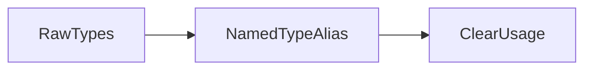

# Lesson 2: Type Aliases

## Learning Objectives

By the end of this lesson, you will be able to:
- Define reusable type aliases for primitives, objects, unions, intersections, and functions
- Understand how type aliases help you name concepts (“make intent obvious”)
- Use unions and intersections intentionally (and avoid confusing them)
- Choose between `interface` and `type` in real projects
- Recognize common pitfalls (widening, conflicting intersections, overly generic aliases)

## Why Type Aliases Matter

Type aliases let you create **names** for types.

This improves:
- readability (“what does this value mean?”)
- maintainability (change the shape once)
- correctness (stronger contracts at module boundaries)



## Basic Type Aliases

Create custom type names:

```typescript
type Age = number;
type Name = string;

const age: Age = 25;
const name: Name = "Alice";
```

### When this helps

Even if `Age` is “just a number”, the name communicates intent at call sites.

## Object Type Aliases

```typescript
type Person = {
  name: string;
  age: number;
};

const person: Person = {
  name: "Alice",
  age: 25,
};
```

Tip: Prefer named object types over repeating inline object literals.

## Union Types

Union types mean “one of these”.

```typescript
type Status = "active" | "inactive" | "pending";
type ID = string | number;

const status: Status = "active";
const id: ID = "123"; // or 123
```

### Why unions are powerful

They model real-world variability:
- IDs might be numeric in DB but strings in APIs
- statuses are usually a finite set of options

## Intersection Types

Intersection types mean “all of these combined”.

```typescript
type NamePart = { name: string };
type AgePart = { age: number };

type Person = NamePart & AgePart;

const person: Person = {
  name: "Alice",
  age: 25,
};
```

### When intersections are useful

They’re great for “compose multiple concerns”:
- base user data + audit fields
- request payload + metadata

## Type Aliases for Functions

Typing functions is a common use-case.

```typescript
type MathOperation = (a: number, b: number) => number;

const add: MathOperation = (a, b) => a + b;
const multiply: MathOperation = (a, b) => a * b;
```

### Why function aliases matter

They prevent accidentally passing the wrong callback shape.

## Type vs Interface (Practical Guidance)

Use **type aliases** when:
- you need unions (`A | B`)
- you need intersections (`A & B`)
- you need mapped/conditional types (advanced)
- you want function types / tuples

Use **interfaces** when:
- you want a stable object contract
- you want declaration merging (rare but important for globals)
- you want classic `extends` composition style

## Real-World Scenario: API Responses

```typescript
type ApiSuccess<T> = { status: "success"; data: T };
type ApiError = { status: "error"; message: string };
type ApiResult<T> = ApiSuccess<T> | ApiError;

type User = { id: string; email: string };

function handleUserResult(result: ApiResult<User>) {
  if (result.status === "success") {
    console.log(result.data.email);
  } else {
    console.log("Error:", result.message);
  }
}
```

This pattern scales across many endpoints.

## Best Practices

### 1) Use literal unions for enums-of-values

```typescript
type Role = "admin" | "user";
```

### 2) Avoid meaningless aliases

`type X = string` is only useful when the name clarifies intent.

### 3) Keep types small and compose them

Prefer small building blocks plus unions/intersections over massive single types.

## Common Pitfalls and Solutions

### Pitfall 1: Confusing union and intersection

**Problem:**
Thinking `A | B` means “has both”.

**Solution:**
- `A | B` = one of them
- `A & B` = both combined

### Pitfall 2: Conflicting intersections

**Problem:**

```typescript
type A = { id: string };
type B = { id: number };
type C = A & B; // id becomes never-like and is impossible to satisfy
```

**Solution:**
Avoid intersecting incompatible property types; redesign the model or use a union.

### Pitfall 3: Widening literal values unintentionally

**Problem:**

```typescript
const status = "active"; // inferred string, not "active" (depends on context)
```

**Solution:**
Use explicit annotation when you need the literal union:

```typescript
const status: Status = "active";
```

## Troubleshooting

### Issue: "Type 'X' is not assignable to type 'Y'"

**Symptoms:**
- You assign a value to a type alias and TS complains.

**Solutions:**
1. Check that your value matches the required shape.
2. If using unions, narrow before accessing properties.
3. If using intersections, check for conflicting fields.

### Issue: "Type instantiation is excessively deep and possibly infinite"

**Symptoms:**
- TS errors when types are too complex (often recursive generics).

**Solutions:**
1. Simplify the type structure.
2. Break complex aliases into smaller types.
3. Avoid deep conditional/mapped recursion (advanced).

## Next Steps

Now that you understand type aliases:

1. ✅ **Practice**: Create type aliases for `ID`, `Status`, and a typed API result
2. ✅ **Experiment**: Compare modeling with an interface vs a type alias
3. 📖 **Next Lesson**: Learn about [Union and Intersection Types](./lesson-03-union-intersection.md)
4. 💻 **Complete Exercises**: Work through [Exercises 04](./exercises-04.md)

## Additional Resources

- [TypeScript Handbook: Everyday Types](https://www.typescriptlang.org/docs/handbook/2/everyday-types.html)
- [TypeScript Handbook: Unions and Intersection Types](https://www.typescriptlang.org/docs/handbook/unions-and-intersections.html)
- [TypeScript Handbook: More on Functions](https://www.typescriptlang.org/docs/handbook/2/functions.html)

---

**Key Takeaways:**
- Type aliases name types and make intent clearer.
- Use unions (`|`) for “one of these” and intersections (`&`) for composition.
- Function type aliases are great for callbacks and reusable signatures.
- Prefer `type` for unions/advanced type logic; prefer `interface` for stable object contracts.
- Watch out for conflicting intersections and unintended widening.
