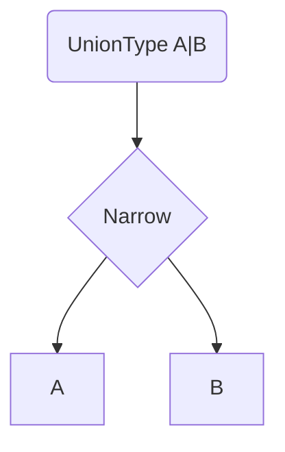

# Lesson 3: Union and Intersection Types

## Learning Objectives

By the end of this lesson, you will be able to:
- Use union types (`|`) to model values that can have multiple shapes
- Use intersections (`&`) to compose multiple types into one
- Narrow unions safely with built-in checks and custom type guards
- Build discriminated unions and use exhaustive switches (the “TypeScript way”)
- Recognize common pitfalls (conflicting intersections, accessing properties too early)

## Why This Matters

Most real programs deal with “sometimes this, sometimes that”:
- user input can be string/number
- API calls can succeed or fail
- optional values can be missing

Union and intersection types let you model these realities with compile-time safety.



## Union Types (`|`)

A value can be one of several types:

```typescript
type StringOrNumber = string | number;

function processValue(value: StringOrNumber) {
  if (typeof value === "string") {
    console.log(value.toUpperCase());
  } else {
    console.log(value.toFixed(2));
  }
}
```

### Key rule

With unions, you can only use members common to **all** union parts unless you narrow first.

## Narrowing (Type Guards)

### Built-in narrowing: `typeof`

```typescript
function print(value: string | number) {
  if (typeof value === "string") {
    console.log(value.toUpperCase());
  } else {
    console.log(value.toFixed(2));
  }
}
```

### Custom type guard functions

```typescript
function isString(value: string | number): value is string {
  return typeof value === "string";
}

function process(value: string | number) {
  if (isString(value)) {
    console.log(value.toUpperCase()); // value: string
  } else {
    console.log(value.toFixed(2)); // value: number
  }
}
```

## Discriminated Unions (Recommended Pattern)

Use a common “tag” property to distinguish union members.

```typescript
type Success = {
  status: "success";
  data: string;
};

type Failure = {
  status: "error";
  message: string;
};

type Result = Success | Failure;
```

### Handling with `if/else`

```typescript
function handleResult(result: Result) {
  if (result.status === "success") {
    console.log(result.data);
  } else {
    console.log(result.message);
  }
}
```

### Handling with an exhaustive `switch`

This is the “Level‑1 standard” safe approach:

```typescript
function assertNever(value: never): never {
  throw new Error(`Unexpected value: ${JSON.stringify(value)}`);
}

function handleResultStrict(result: Result) {
  switch (result.status) {
    case "success":
      return result.data;
    case "error":
      return result.message;
    default:
      return assertNever(result);
  }
}
```

## Intersection Types (`&`)

Intersections combine multiple types into one.

```typescript
type Name = { name: string };
type Age = { age: number };
type Email = { email: string };

type User = Name & Age & Email;

const user: User = {
  name: "Alice",
  age: 25,
  email: "alice@example.com",
};
```

### When to use intersections

- composing “base type + extra fields”
- mixing concerns (e.g., `Entity & Auditable`)

## Real-World Scenario: API Results

```typescript
type ApiSuccess<T> = { status: "success"; data: T };
type ApiError = { status: "error"; message: string; errorCode?: string };
type ApiResult<T> = ApiSuccess<T> | ApiError;

type User = { id: string; email: string };

function renderUser(result: ApiResult<User>) {
  switch (result.status) {
    case "success":
      return result.data.email;
    case "error":
      return `Error: ${result.message}`;
  }
}
```

## Best Practices

### 1) Prefer discriminated unions for complex branching

They scale better than `typeof` checks for object-shaped data.

### 2) Don’t intersect incompatible property types

If `id` is `string` in one type and `number` in another, intersection becomes impossible.

### 3) Narrow early, then use safely

Avoid accessing union-specific fields before narrowing.

## Common Pitfalls and Solutions

### Pitfall 1: Accessing union-specific properties too early

**Problem:**

```typescript
type A = { kind: "a"; a: string };
type B = { kind: "b"; b: number };
type U = A | B;

function bad(u: U) {
  // u.a; // ❌ Property 'a' does not exist on type 'U'
}
```

**Solution:**

```typescript
function good(u: U) {
  if (u.kind === "a") {
    console.log(u.a);
  } else {
    console.log(u.b);
  }
}
```

### Pitfall 2: Conflicting intersections

**Problem:**

```typescript
type A = { id: string };
type B = { id: number };
type C = A & B; // not realistically constructable
```

**Solution:** Redesign the model (use a union or align the field types).

## Troubleshooting

### Issue: "Property 'x' does not exist on type ..."

**Symptoms:**
- You try to access a property that only exists on one union member.

**Solutions:**
1. Narrow with `typeof`, `in`, `instanceof`, or a discriminant tag.
2. Use a custom type guard function (`value is T`).

### Issue: "Type 'A' is not assignable to type 'A & B'"

**Symptoms:**
- You attempted to assign something missing fields required by an intersection.

**Solutions:**
1. Ensure the value includes *all* fields from both types.
2. If you meant “either”, use a union (`A | B`) not an intersection.

## Next Steps

Now that you understand unions and intersections:

1. ✅ **Practice**: Model an API response using a discriminated union
2. ✅ **Experiment**: Add a new union member and confirm exhaustive switching catches it
3. 📖 **Next Level**: Continue to the next TypeScript level
4. 💻 **Complete Exercises**: Work through [Exercises 04](./exercises-04.md)

## Additional Resources

- [TypeScript Handbook: Narrowing](https://www.typescriptlang.org/docs/handbook/2/narrowing.html)
- [TypeScript Handbook: Unions and Intersection Types](https://www.typescriptlang.org/docs/handbook/unions-and-intersections.html)

---

**Key Takeaways:**
- Unions (`|`) model “one of several types” and require narrowing before using specific fields.
- Intersections (`&`) model composition (“must satisfy all parts”).
- Discriminated unions + exhaustive switches are a best-practice pattern.
- Custom type guards (`value is T`) let you safely narrow complex unions.
- Avoid intersecting incompatible property types (it becomes impossible to satisfy).
