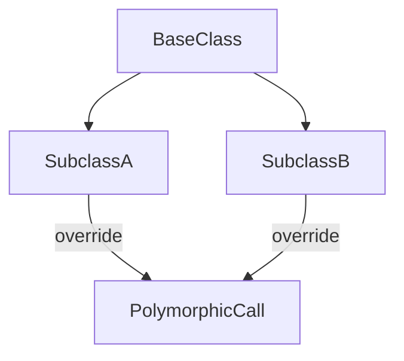

# Lesson 2: Inheritance

## Learning Objectives

By the end of this lesson, you will be able to:
- Use `extends` to create subclasses
- Use `super()` correctly in constructors and overrides
- Override methods safely (and understand polymorphism)
- Decide when inheritance is appropriate vs when composition is better
- Recognize common pitfalls (forgetting `super`, brittle hierarchies, wrong override assumptions)

## Why Inheritance Matters (and When It Hurts)

Inheritance can model “is-a” relationships:
- `Dog` is an `Animal`
- `AdminUser` is a `User`

But inheritance can become rigid when requirements change. In many modern codebases, **composition** is preferred unless inheritance is truly the right fit.



## Extending Classes

Use `extends` to create subclasses:

```typescript
class Animal {
  name: string;

  constructor(name: string) {
    this.name = name;
  }

  speak(): void {
    console.log(`${this.name} makes a sound`);
  }
}

class Dog extends Animal {
  breed: string;

  constructor(name: string, breed: string) {
    super(name); // Call parent constructor
    this.breed = breed;
  }

  speak(): void {
    console.log(`${this.name} barks`);
  }
}

const dog = new Dog("Buddy", "Golden Retriever");
dog.speak(); // "Buddy barks"
```

### Key points

- `Dog` inherits `name` from `Animal`
- `Dog` adds its own field: `breed`
- `Dog` overrides `speak()`

## Method Overriding

Subclasses can override parent methods to customize behavior:

```typescript
class Shape {
  area(): number {
    return 0;
  }
}

class Circle extends Shape {
  radius: number;

  constructor(radius: number) {
    super();
    this.radius = radius;
  }

  area(): number {
    return Math.PI * this.radius ** 2;
  }
}
```

### Polymorphism (one interface, many implementations)

```typescript
const shapes: Shape[] = [new Shape(), new Circle(5)];
const areas = shapes.map((s) => s.area()); // calls the right implementation at runtime
```

## The `super` Keyword

Use `super` to call parent class methods or access parent behavior.

```typescript
class Parent {
  greet(): string {
    return "Hello from parent";
  }
}

class Child extends Parent {
  greet(): string {
    return super.greet() + " and child";
  }
}
```

## Real-World Scenario: Extending a Base Error Class

Custom error hierarchies are a practical use of inheritance:

```typescript
class AppError extends Error {
  constructor(public code: string, message: string) {
    super(message);
    this.name = "AppError";
  }
}

class ValidationError extends AppError {
  constructor(message: string) {
    super("VALIDATION_ERROR", message);
    this.name = "ValidationError";
  }
}
```

Now you can catch by base type (`AppError`) and still preserve specific error info.

## Composition vs Inheritance (Important)

Sometimes inheritance is the wrong tool. Example: instead of “UserWithLogging extends User”, you might inject a logger:

```typescript
type Logger = { info(msg: string): void };

class UserService {
  constructor(private logger: Logger) {}
  create(email: string) {
    this.logger.info(`Creating ${email}`);
    return { id: "u1", email };
  }
}
```

This is often easier to test and change later.

## Best Practices

### 1) Only use inheritance for true “is-a” relationships

If it’s more like “has-a”, composition is usually better.

### 2) Keep base classes small

Huge base classes create fragile hierarchies.

### 3) Prefer overriding behavior, not data shape

If subclasses need totally different fields, consider unions or separate types.

## Common Pitfalls and Solutions

### Pitfall 1: Forgetting `super()` in a subclass constructor

**Problem:**
In JS/TS, `this` can’t be used before `super()` in a subclass.

**Solution:**
Call `super(...)` first in the subclass constructor.

### Pitfall 2: Inheritance becomes a “god hierarchy”

**Problem:**
Too many subclasses for tiny differences makes the design hard to maintain.

**Solution:**
Use composition and small focused classes instead.

## Troubleshooting

### Issue: "Must call super constructor in derived class before accessing 'this'"

**Symptoms:**
- Runtime error when constructing a subclass.

**Solutions:**
1. Call `super(...)` before using `this` in the constructor.
2. Ensure the arguments passed to `super(...)` match the base constructor.

### Issue: Method override not behaving as expected

**Symptoms:**
- You think the overridden method should run, but base behavior appears.

**Solutions:**
1. Confirm the method name/signature matches exactly.
2. Ensure you’re calling the method on the subclass instance.
3. Use `override` (TS feature) when available to catch mistakes (if your TS config supports it).

## Next Steps

Now that you understand inheritance:

1. ✅ **Practice**: Create a base `Shape` class and two subclasses with overridden `area()`
2. ✅ **Experiment**: Refactor one inheritance example into composition
3. 📖 **Next Lesson**: Learn about [Access Modifiers](./lesson-03-access-modifiers.md)
4. 💻 **Complete Exercises**: Work through [Exercises 05](./exercises-05.md)

## Additional Resources

- [TypeScript Handbook: Classes](https://www.typescriptlang.org/docs/handbook/2/classes.html)
- [MDN: Inheritance and the prototype chain](https://developer.mozilla.org/en-US/docs/Web/JavaScript/Inheritance_and_the_prototype_chain)

---

**Key Takeaways:**
- `extends` creates a subclass that inherits from a base class.
- `super()` must be called in derived constructors before using `this`.
- Overriding enables polymorphism (base type, multiple behaviors).
- Inheritance can become rigid; composition is often more flexible.
- Keep base classes small and use inheritance only for real “is-a” relationships.
