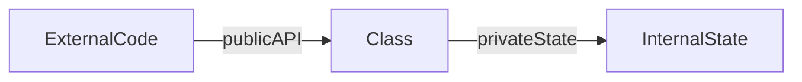

# Lesson 3: Access Modifiers

## Learning Objectives

By the end of this lesson, you will be able to:
- Explain `public`, `private`, `protected`, and `readonly`
- Use access modifiers to enforce invariants (prevent invalid state changes)
- Understand how modifiers affect inheritance (especially `protected`)
- Recognize common pitfalls (trying to access private state, “readonly isn’t frozen”)
- Apply good encapsulation patterns (getters/setters, methods over direct field access)

## Why Access Modifiers Matter

Access modifiers help you design safer APIs:
- Consumers can’t mutate internal state incorrectly
- You can change internals without breaking callers
- Invariants (rules) can be enforced in one place



## `public` (Default)

All members are public by default:

```typescript
class Person {
  public name: string; // public is optional
  age: number;         // also public

  constructor(name: string, age: number) {
    this.name = name;
    this.age = age;
  }
}
```

Public means any code can read/write the field.

## `private`

Private members are only accessible inside the class.

```typescript
class BankAccount {
  private balance: number = 0;

  deposit(amount: number): void {
    this.balance += amount;
  }

  getBalance(): number {
    return this.balance;
  }
}

const account = new BankAccount();
// account.balance; // ❌ Error: Property 'balance' is private
account.deposit(100);
console.log(account.getBalance()); // 100
```

### Why this is good

You can enforce rules like “no negative deposits”:

```typescript
deposit(amount: number): void {
  if (amount <= 0) throw new Error("Deposit must be positive");
  this.balance += amount;
}
```

## `protected`

Protected members are accessible inside the class **and subclasses**.

```typescript
class Animal {
  protected name: string;

  constructor(name: string) {
    this.name = name;
  }
}

class Dog extends Animal {
  getName(): string {
    return this.name; // ✅ OK: protected members accessible in subclasses
  }
}
```

### When to use protected

Use it when subclasses must customize behavior using shared internal state, but you still want to hide that state from external callers.

## `readonly`

Readonly makes a property assignable only during initialization (constructor or field initializer).

```typescript
class Person {
  readonly id: number;
  name: string;

  constructor(id: number, name: string) {
    this.id = id;
    this.name = name;
  }
}

const person = new Person(1, "Alice");
// person.id = 2; // ❌ Error: Cannot assign to 'id' because it is a read-only property
```

### Readonly is not deep immutability

If `readonly` points to an object, the object can still be mutated unless the object type is readonly too.

## Real-World Scenario: Encapsulating Invariants

```typescript
class TemperatureC {
  constructor(private _value: number) {
    if (Number.isNaN(_value)) throw new Error("Temperature must be a number");
  }

  get value(): number {
    return this._value;
  }

  set value(next: number) {
    if (Number.isNaN(next)) throw new Error("Temperature must be a number");
    this._value = next;
  }
}
```

External code uses the public getter/setter, but validation stays centralized.

## Best Practices

### 1) Prefer private fields + public methods

Expose behavior, not raw state.

### 2) Use readonly for identity fields

IDs and created timestamps are often good candidates.

### 3) Use protected sparingly

It can encourage inheritance-heavy designs; consider composition first.

## Common Pitfalls and Solutions

### Pitfall 1: Trying to access a private field from outside

**Problem:**

```typescript
class A { private x = 1; }
const a = new A();
// console.log(a.x); // ❌
```

**Solution:**
Provide a public method/getter to expose what’s necessary.

### Pitfall 2: Using public fields for everything

**Problem:**
Any caller can put your class into an invalid state.

**Solution:**
Make state private and enforce rules through methods.

## Troubleshooting

### Issue: "Property 'x' is private and only accessible within class ..."

**Symptoms:**
- You can’t access a field from outside the class.

**Solutions:**
1. Add a public method/getter to expose what’s needed.
2. Re-check whether the field should be private or public.

### Issue: "Cannot assign to 'x' because it is a read-only property"

**Symptoms:**
- You try to reassign a readonly property.

**Solutions:**
1. If the value should change, remove `readonly`.
2. If the value shouldn’t change, create a new instance instead of mutating.

## Next Steps

Now that you understand access modifiers:

1. ✅ **Practice**: Build a class with `private` state and public methods enforcing rules
2. ✅ **Experiment**: Create a subclass that uses a `protected` field
3. 📖 **Next Level**: Continue to the next TypeScript level
4. 💻 **Complete Exercises**: Work through [Exercises 05](./exercises-05.md)

## Additional Resources

- [TypeScript Handbook: Classes](https://www.typescriptlang.org/docs/handbook/2/classes.html)
- [TypeScript Handbook: Members](https://www.typescriptlang.org/docs/handbook/2/classes.html#member-visibility)

---

**Key Takeaways:**
- `public` is accessible everywhere (default).
- `private` is accessible only within the class.
- `protected` is accessible within the class and subclasses.
- `readonly` prevents reassignment after initialization.
- Encapsulation helps enforce invariants and prevents invalid state.
