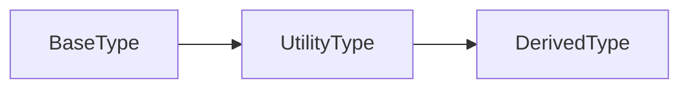

# Lesson 2: Utility Types

## Learning Objectives

By the end of this lesson, you will be able to:
- Explain what TypeScript utility types are and why they exist
- Use `Partial`, `Required`, `Pick`, `Omit`, `Readonly`, and `Record`
- Choose the right utility type for a specific job (API DTOs, config, security)
- Recognize common pitfalls (shallow readonly, overly-permissive Partial, wrong Record keys)

## Why Utility Types Matter

Utility types help you transform existing types without rewriting them.

This keeps your code:
- DRY (don’t repeat yourself)
- consistent (one source of truth)
- safer (fewer manual type edits)



## `Partial<T>`

Makes all properties optional.

```typescript
interface User {
  name: string;
  age: number;
  email: string;
}

type PartialUser = Partial<User>;
// { name?: string; age?: number; email?: string; }
```

### Real use: patch/update payloads

```typescript
function updateUser(user: User, patch: Partial<User>): User {
  return { ...user, ...patch };
}
```

## `Required<T>`

Makes all properties required.

```typescript
interface Config {
  apiKey?: string;
  timeout?: number;
}

type RequiredConfig = Required<Config>;
// { apiKey: string; timeout: number; }
```

### Real use: validating config then treating it as complete

You can validate at runtime, then use a `Required` type to represent “now it’s complete”.

## `Pick<T, K>`

Select specific properties.

```typescript
interface User {
  name: string;
  age: number;
  email: string;
}

type UserContact = Pick<User, "name" | "email">;
// { name: string; email: string; }
```

### Real use: DTOs (Data Transfer Objects)

Expose only safe fields to the client.

## `Omit<T, K>`

Remove specific properties.

```typescript
interface User {
  name: string;
  age: number;
  email: string;
}

type UserWithoutEmail = Omit<User, "email">;
// { name: string; age: number; }
```

### Real use: removing sensitive fields

```typescript
type UserDb = User & { passwordHash: string };
type PublicUser = Omit<UserDb, "passwordHash">;
```

## `Readonly<T>`

Make all properties readonly.

```typescript
interface User {
  name: string;
  age: number;
}

type ReadonlyUser = Readonly<User>;
// { readonly name: string; readonly age: number; }
```

### Important: Readonly is shallow

If a property is an object, that object can still be mutated unless it’s readonly too.

## `Record<K, V>`

Create an object type with specific keys and values.

```typescript
type UserRoles = Record<string, boolean>;

const roles: UserRoles = {
  admin: true,
  user: false,
};
```

### Better: use a union for keys

```typescript
type Role = "admin" | "user" | "moderator";
type RoleFlags = Record<Role, boolean>;

const flags: RoleFlags = {
  admin: true,
  user: true,
  moderator: false,
};
```

## Real-World Scenario: API Response Shaping

```typescript
type UserDb = {
  id: string;
  email: string;
  name: string;
  passwordHash: string;
};

type UserPublic = Omit<UserDb, "passwordHash">;
type UserPatch = Partial<Pick<UserDb, "email" | "name">>;
```

This is a very common pattern: database model → public model → patch model.

## Best Practices

### 1) Prefer `Pick/Omit` for public boundaries

They make it obvious what’s exposed.

### 2) Be careful with `Partial` on nested objects

`Partial` is shallow—nested objects are not partially optional unless you design for that.

### 3) Use unions for `Record` keys when possible

It prevents typos and missing keys.

## Common Pitfalls and Solutions

### Pitfall 1: Assuming `Readonly` prevents deep mutation

**Problem:**

```typescript
type Config = { options: { debug: boolean } };
const c: Readonly<Config> = { options: { debug: false } };
c.options.debug = true; // ✅ allowed (shallow readonly)
```

**Solution:** Use deeper readonly patterns (advanced) or avoid exposing mutable nested objects.

### Pitfall 2: Overusing `Partial` for “anything goes”

**Problem:** Update payloads become too permissive and allow fields you don’t want updated.

**Solution:** Use `Partial<Pick<T, ...>>` to restrict to allowed fields.

### Pitfall 3: `Record<string, ...>` hides typos

**Problem:** any key is allowed.

**Solution:** use `Record<"a" | "b", ...>` when keys are known.

## Troubleshooting

### Issue: "Type 'X' is not assignable to type 'Pick<...>' / 'Omit<...>'"

**Symptoms:**
- You attempt to assign a value missing required picked fields.

**Solutions:**
1. Provide the required fields.
2. If fields are optional, adjust the base type (or use `Partial` appropriately).

### Issue: "Property 'foo' does not exist on type ..."

**Symptoms:**
- After `Omit`, you can’t access a removed field (expected).

**Solutions:**
1. If you need the field, don’t omit it.
2. If the field is sensitive, keep it omitted and restructure code.

## Next Steps

Now that you understand utility types:

1. ✅ **Practice**: Create a `UserDb` type and derive `UserPublic` with `Omit`
2. ✅ **Experiment**: Build an update payload type with `Partial<Pick<...>>`
3. 📖 **Next Lesson**: Learn about [Conditional Types](./lesson-03-conditional-types.md)
4. 💻 **Complete Exercises**: Work through [Exercises 06](./exercises-06.md)

## Additional Resources

- [TypeScript Handbook: Utility Types](https://www.typescriptlang.org/docs/handbook/utility-types.html)
- [TypeScript Handbook: Mapped Types](https://www.typescriptlang.org/docs/handbook/2/mapped-types.html)

---

**Key Takeaways:**
- Utility types transform existing types without repetition.
- `Partial`/`Required` make properties optional/required (shallow).
- `Pick`/`Omit` select or remove fields—great for DTOs and security.
- `Readonly` prevents reassignment but is shallow.
- `Record` maps keys to values; use union keys when possible to avoid typos.
