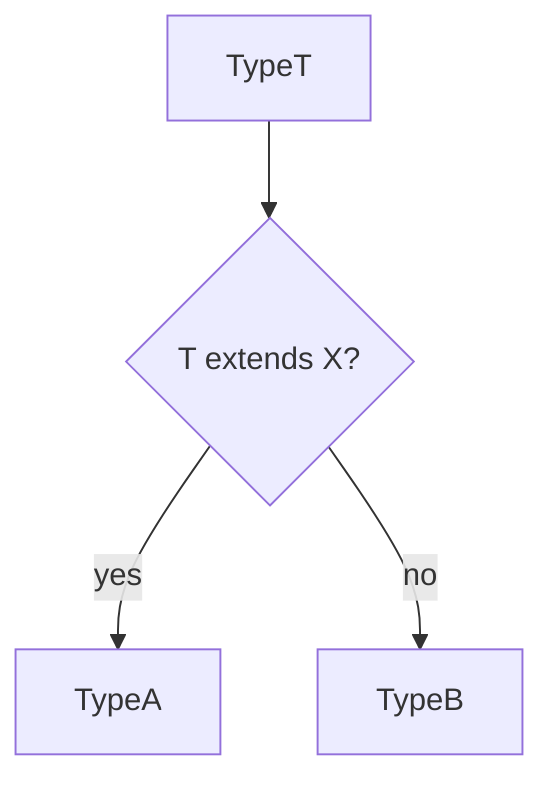

# Lesson 3: Conditional Types

## Learning Objectives

By the end of this lesson, you will be able to:
- Explain what conditional types are and when they’re useful
- Use `extends ? :` type logic to create reusable type utilities
- Use `infer` to extract types from other types
- Understand distributive conditional types over unions
- Use mapped types and template literal types as “type-level transformations”
- Recognize common pitfalls (distribution surprises, overly complex types, `never` confusion)

## Why Conditional Types Matter

Conditional types let you write “if/else” logic at the type level.

This is how many built-in utilities work, and it unlocks powerful abstractions without runtime cost.



## Basic Conditional Types

Conditional types select types based on conditions:

```typescript
type IsArray<T> = T extends Array<any> ? true : false;

type Test1 = IsArray<number[]>; // true
type Test2 = IsArray<string>;   // false
```

### Practical example: NonNullable

```typescript
type NonNullable2<T> = T extends null | undefined ? never : T;

type A = NonNullable2<string | null>; // string
type B = NonNullable2<number | undefined>; // number
```

## `infer` Keyword

Extract types from other types:

```typescript
type ArrayElementType<T> = T extends Array<infer U> ? U : never;

type Element = ArrayElementType<number[]>; // number
```

### Another common infer pattern: ReturnType

```typescript
type ReturnType2<T> = T extends (...args: any[]) => infer R ? R : never;

type R = ReturnType2<() => string>; // string
```

## Distributive Conditional Types

Conditional types distribute over union types when the checked type is a “naked” type parameter.

```typescript
type ToArray<T> = T extends any ? T[] : never;

type StrArrOrNumArr = ToArray<string | number>;
// string[] | number[]
```

### Why this can surprise you

```typescript
type Wrap<T> = T extends string ? { kind: "s"; value: T } : { kind: "o"; value: T };

type W = Wrap<string | number>;
// Wrap<string> | Wrap<number>  (distributed)
```

If you want to prevent distribution, wrap in a tuple:

```typescript
type NoDistribute<T> = [T] extends [string] ? true : false;
type ND = NoDistribute<string | number>; // false
```

## Mapped Types

Transform types by mapping over properties:

```typescript
type Optional<T> = {
  [P in keyof T]?: T[P];
};

interface User {
  name: string;
  age: number;
}

type OptionalUser = Optional<User>;
// { name?: string; age?: number; }
```

### Real use: readonly + partial variants

```typescript
type ReadonlyOptional<T> = {
  readonly [K in keyof T]?: T[K];
};
```

## Template Literal Types

Create string literal types:

```typescript
type EventName<T extends string> = `on${Capitalize<T>}`;

type ClickEvent = EventName<"click">;   // "onClick"
type SubmitEvent = EventName<"submit">; // "onSubmit"
```

### Real use: strongly-typed event maps

```typescript
type Event = "click" | "submit";
type HandlerName = EventName<Event>; // "onClick" | "onSubmit"
```

## Real-World Scenario: Building a Type-Safe Configuration API

```typescript
type Env = "dev" | "prod";

type ConfigFor<E extends Env> = E extends "prod"
  ? { debug: false; logLevel: "warn" | "error" }
  : { debug: true; logLevel: "debug" | "info" | "warn" | "error" };

type DevConfig = ConfigFor<"dev">;
type ProdConfig = ConfigFor<"prod">;
```

You can represent environment-specific constraints at the type level.

## Best Practices

### 1) Keep type-level logic readable

If the type is too complex, split it into smaller helpers.

### 2) Avoid “type puzzles” unless you need them

Conditional types are powerful but can reduce readability for beginners.

### 3) Test types with example aliases

Create `type TestX = ...` to confirm behavior.

## Common Pitfalls and Solutions

### Pitfall 1: Unexpected distribution over unions

**Problem:**
Your conditional type distributes and produces a union you didn’t expect.

**Solution:**
Wrap the type parameter: `[T] extends [...] ? ... : ...` to stop distribution.

### Pitfall 2: Overusing `never`

**Problem:**
Types collapse to `never` unexpectedly and become impossible to use.

**Solution:**
Add test types and confirm each branch returns what you expect.

## Troubleshooting

### Issue: "Type instantiation is excessively deep and possibly infinite"

**Symptoms:**
- TypeScript fails when types are too recursive/complex.

**Solutions:**
1. Simplify the conditional/mapped recursion.
2. Break the type into smaller pieces.
3. Avoid deeply nested conditional chains.

### Issue: Type isn’t narrowing the way you expect

**Symptoms:**
- Your output type is broader or different than expected.

**Solutions:**
1. Add test aliases (`type T1 = ...`) to see the computed type.
2. Check whether your type is distributing over a union.
3. Use tuple wrapping to control distribution.

## Next Steps

Now that you understand conditional types and other advanced type tools:

1. ✅ **Practice**: Write `ArrayElementType<T>` and test it on `string[]`, `number[]`, and `string`
2. ✅ **Experiment**: Create a distributive type, then stop distribution with tuple wrapping
3. 📖 **Next Level**: Continue to the next TypeScript level
4. 💻 **Complete Exercises**: Work through [Exercises 06](./exercises-06.md)

## Additional Resources

- [TypeScript Handbook: Conditional Types](https://www.typescriptlang.org/docs/handbook/2/conditional-types.html)
- [TypeScript Handbook: Mapped Types](https://www.typescriptlang.org/docs/handbook/2/mapped-types.html)
- [TypeScript Handbook: Template Literal Types](https://www.typescriptlang.org/docs/handbook/2/template-literal-types.html)

---

**Key Takeaways:**
- Conditional types add type-level “if/else” logic with no runtime cost.
- `infer` extracts types from other types (arrays, functions, etc.).
- Conditional types distribute over unions unless you prevent it.
- Mapped types transform object properties; template literal types transform strings.
- Keep advanced types readable and test them with example type aliases.
