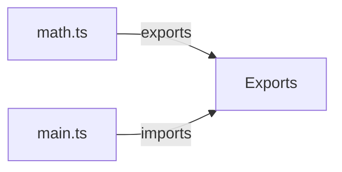
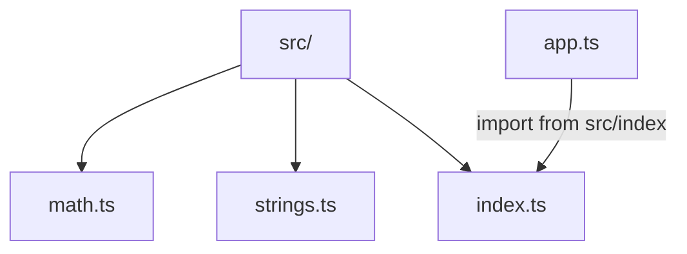

# Lesson 1: Modules

## Learning Objectives

By the end of this lesson, you will be able to:
- Explain what ES modules are and why TypeScript uses them
- Create modules using `export` and consume them with `import`
- Choose between named exports and default exports (and know the trade-offs)
- Use barrel files (`index.ts`) to re-export modules cleanly
- Recognize common pitfalls (wrong paths, default-vs-named confusion, circular imports)

## Why Modules Matter

Modules let you split code into files with clear boundaries:
- **encapsulation**: each file exposes a public API via exports
- **maintainability**: smaller files with focused responsibilities
- **tooling**: bundlers, Node.js, and TypeScript all rely on modules



## ES Modules (ESM)

TypeScript supports ES module syntax:

```typescript
// math.ts
export function add(a: number, b: number): number {
  return a + b;
}

export function subtract(a: number, b: number): number {
  return a - b;
}
```

### Importing modules

```typescript
// main.ts
import { add, subtract } from "./math";

console.log(add(5, 3));      // 8
console.log(subtract(5, 3)); // 2
```

## Named Exports vs Default Exports

### Named exports

Named exports are explicit and play well with refactors:

```typescript
// strings.ts
export function upper(s: string) {
  return s.toUpperCase();
}
```

```typescript
import { upper } from "./strings";
```

### Default exports

Default exports export “the main thing” from a module:

```typescript
// calculator.ts
export default class Calculator {
  add(a: number, b: number): number {
    return a + b;
  }
}
```

```typescript
// main.ts
import Calculator from "./calculator";

const calc = new Calculator();
```

### Which should you use?

- Prefer **named exports** for libraries and modules with multiple exports.
- Use **default exports** when a file truly has one primary export and you want simpler imports.

## Mixing Named and Default Exports

This is valid, but be consistent:

```typescript
// utils.ts
export const PI = 3.14159;

export default function greet(name: string): string {
  return `Hello, ${name}!`;
}
```

```typescript
// main.ts
import greet, { PI } from "./utils";
```

## Re-exports (Barrel Files)

Re-exporting lets consumers import from a single module entrypoint.

```typescript
// index.ts
export { add, subtract } from "./math";
export { default as Calculator } from "./calculator";
```

```typescript
// main.ts
import { add, Calculator } from "./index";
```

### Why barrels can help

- cleaner imports
- fewer deep relative paths
- “public API” control

## Real-World Scenario: A Small Library Layout



## Best Practices

### 1) Keep each module focused

Avoid huge “utils” files that become dumping grounds. Split by feature.

### 2) Prefer named exports for shared code

It makes “what is exported” more visible.

### 3) Avoid circular dependencies

Circular imports can lead to `undefined` values at runtime and confusing behavior.

## Common Pitfalls and Solutions

### Pitfall 1: Default vs named export mismatch

**Problem:**
You export named but import default (or vice versa).

```typescript
// math.ts
export function add(a: number, b: number) {
  return a + b;
}

// main.ts
import add from "./math"; // ❌ wrong: add is not default export
```

**Solution:**

```typescript
import { add } from "./math"; // ✅ named import
```

### Pitfall 2: Wrong relative import paths

**Problem:** `./math` vs `../math` errors or importing the wrong file.

**Solution:** Use clear folder structure and consider a single `index.ts` entrypoint per folder.

## Troubleshooting

### Issue: "Cannot find module './x' or its corresponding type declarations"

**Symptoms:**
- TypeScript can’t resolve the import path.

**Solutions:**
1. Confirm the file exists and the relative path is correct.
2. Check `tsconfig.json` `moduleResolution` and `baseUrl/paths` (if used).
3. Ensure you’re not missing file extensions/exports in ESM setups (depends on runtime/bundler).

### Issue: Import is `undefined` at runtime

**Symptoms:**
- Code compiles but the imported value is `undefined`.

**Solutions:**
1. Look for circular dependencies.
2. Confirm you imported the correct export (named vs default).

## Next Steps

Now that you understand modules:

1. ✅ **Practice**: Create `math.ts` and import it from `main.ts`
2. ✅ **Experiment**: Build a barrel `index.ts` and re-export 2 modules
3. 📖 **Next Lesson**: Learn about [Imports and Exports](./lesson-02-imports-exports.md)
4. 💻 **Complete Exercises**: Work through [Exercises 07](./exercises-07.md)

## Additional Resources

- [TypeScript Handbook: Modules](https://www.typescriptlang.org/docs/handbook/modules/introduction.html)
- [MDN: JavaScript Modules](https://developer.mozilla.org/en-US/docs/Web/JavaScript/Guide/Modules)

---

**Key Takeaways:**
- Modules organize code by file and expose a public API via exports.
- Named exports are explicit; default exports export “the main thing”.
- Re-exports (`index.ts`) help define clean public entrypoints.
- Watch for default/named import mismatches and circular dependencies.
