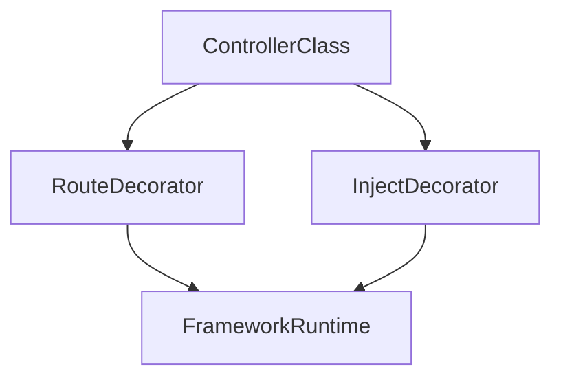

# Lesson 1: Decorators

## Learning Objectives

By the end of this lesson, you will be able to:
- Explain what decorators are and what problems they try to solve
- Distinguish **legacy (experimental)** TypeScript decorators vs **standard** decorators
- Use decorators safely for common use cases (logging, validation metadata, DI hooks)
- Understand where decorators fit in real projects (e.g. NestJS uses legacy decorators)
- Recognize common pitfalls (runtime side effects, order of evaluation, typing surprises)

## Why Decorators Matter

Decorators let you attach behavior or metadata to classes and class members.

In practice, they’re often used for:
- dependency injection
- routing/controllers (frameworks)
- validation/serialization metadata
- instrumentation (logging, tracing)


## Important: Two Decorator “Worlds” in TypeScript

TypeScript supports:
- **Legacy decorators** (enabled by `experimentalDecorators: true`) — used by many frameworks today.
- **Standard decorators** (newer JS proposal) — TypeScript supports them with different signatures and behavior.

Because courses and codebases vary, you must recognize which decorator system you’re using.

## Enabling Legacy Decorators

Legacy decorators require a compiler option:

```json
{
  "compilerOptions": {
    "experimentalDecorators": true
  }
}
```

If you also see `emitDecoratorMetadata`, that’s an additional legacy pattern used with reflection in some frameworks.

## Legacy Decorators: Class Decorator Example

```typescript
function sealed(constructor: Function) {
  Object.seal(constructor);
  Object.seal(constructor.prototype);
}

@sealed
class Greeter {
  greeting: string;
  constructor(message: string) {
    this.greeting = message;
  }
}
```

### What this does

- `@sealed` runs when the class is defined (not when an instance is created)
- it seals the constructor and prototype, preventing adding new properties later

## Legacy Decorators: Method Decorator Example (Logging)

```typescript
function log(target: any, propertyKey: string, descriptor: PropertyDescriptor) {
  const originalMethod = descriptor.value;

  descriptor.value = function (...args: any[]) {
    console.log(`Calling ${propertyKey} with`, args);
    return originalMethod.apply(this, args);
  };

  return descriptor;
}

class Calculator {
  @log
  add(a: number, b: number): number {
    return a + b;
  }
}
```

### What to notice

- this is a **runtime** transformation: it replaces the method implementation
- it can affect `this`, performance, and stack traces

## Legacy Decorators: Property Decorator Caveat

Property decorators do **not** receive a descriptor like method decorators do (legacy behavior).
They typically attach metadata rather than safely rewriting the property.

The example below uses `defineProperty` on the prototype, which can behave unexpectedly for instance fields:

```typescript
function readonly(target: any, propertyKey: string) {
  Object.defineProperty(target, propertyKey, {
    writable: false,
  });
}

class Person {
  @readonly
  name: string = "Alice";
}
```

In real apps, prefer method/parameter decorators for behavior, or use decorators for metadata only.

## Standard Decorators (Conceptual Overview)

Standard decorators use different arguments and are more explicit about what can be decorated and how.

For this course, the key takeaway is:
- **don’t copy/paste legacy decorator signatures into standard decorator mode**
- treat decorators as **advanced** and framework-driven unless you have a strong reason

## Real-World Scenario: Framework Usage (NestJS-style)

Many backend frameworks (like NestJS) rely heavily on decorators to declare controllers, routes, validation, and DI.



Even if you don’t write decorators yourself, you must understand what they do when you use such frameworks.

## Best Practices

### 1) Prefer decorators when a framework expects them

If your toolchain is built around decorators, use them consistently.

### 2) Keep decorators small and predictable

Decorators that silently change runtime behavior can be hard to debug.

### 3) Avoid “magic” in business logic

Keep core logic explicit; use decorators mostly for cross-cutting concerns.

## Common Pitfalls and Solutions

### Pitfall 1: Thinking decorators run per instance

**Problem:** Assuming the decorator runs on every `new`.

**Solution:** Remember most decorators run when the class/module is evaluated.

### Pitfall 2: Confusing legacy vs standard signatures

**Problem:** You get type errors or runtime failures because the decorator arguments don’t match.

**Solution:** Check your TS config and framework requirements (`experimentalDecorators` on/off).

### Pitfall 3: Hidden side effects

**Problem:** A decorator changes behavior in a way that surprises other devs.

**Solution:** Keep decorators focused, document them, and prefer transparent transformations.

## Troubleshooting

### Issue: "Decorators are not valid here" / decorator syntax errors

**Symptoms:**
- TypeScript won’t compile `@decorator`.

**Solutions:**
1. If using legacy decorators, enable `"experimentalDecorators": true`.
2. Confirm you’re on a TypeScript version/toolchain that supports decorators in your chosen mode.

### Issue: Decorator runs but behavior doesn’t change as expected

**Symptoms:**
- Logging doesn’t happen, property isn’t readonly, etc.

**Solutions:**
1. Confirm you decorated the correct target (class vs method vs property).
2. Confirm you returned/updated the descriptor correctly (method decorators).
3. Avoid rewriting instance fields from a property decorator; prefer explicit code or metadata patterns.

## Next Steps

Now that you understand decorators at a high level:

1. ✅ **Practice**: Write a small `@log` method decorator and apply it to two methods
2. ✅ **Experiment**: Observe when decorators run (module load time vs runtime)
3. 📖 **Next Lesson**: Learn about [Mixins](./lesson-02-mixins.md)
4. 💻 **Complete Exercises**: Work through [Exercises 08](./exercises-08.md)

## Additional Resources

- [TypeScript Handbook: Decorators](https://www.typescriptlang.org/docs/handbook/decorators.html)
- [TC39 Decorators Proposal](https://github.com/tc39/proposal-decorators)

---

**Key Takeaways:**
- Decorators attach behavior/metadata to classes and members.
- TypeScript has legacy (experimental) decorators and newer standard decorators—don’t mix them.
- Decorators often run at definition time, not per instance.
- Prefer decorators when frameworks/tooling require them; keep them small and predictable.
