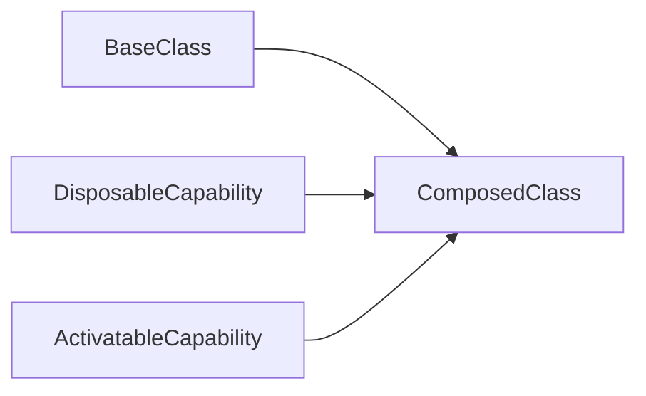

# Lesson 2: Mixins

## Learning Objectives

By the end of this lesson, you will be able to:
- Explain what mixins are and why they exist
- Implement a basic mixin pattern in TypeScript
- Understand the difference between “copying prototypes” mixins and “functional” mixins
- Use constructor constraints to build reusable mixin helpers safely
- Recognize common pitfalls (name collisions, private fields, initialization order)

## Why Mixins Matter

Mixins are a way to reuse behavior **without** deep inheritance trees.

They’re useful when you want to compose capabilities:
- “disposable”
- “activatable”
- “loggable”

This is often a better fit than inheritance when the relationship is “has-a capability” rather than “is-a”.



## Mixin Pattern (Prototype Copying)

This is a classic TypeScript mixin approach: copy prototype members from multiple base classes into one derived class.

```typescript
// Disposable mixin
class Disposable {
  isDisposed: boolean = false;
  dispose() {
    this.isDisposed = true;
  }
}

// Activatable mixin
class Activatable {
  isActive: boolean = false;
  activate() {
    this.isActive = true;
  }
  deactivate() {
    this.isActive = false;
  }
}

// Combined class
class SmartObject implements Disposable, Activatable {
  constructor() {
    setInterval(() => console.log(this.isActive + " : " + this.isDisposed), 500);
  }

  // Disposable
  isDisposed: boolean = false;
  dispose: () => void;

  // Activatable
  isActive: boolean = false;
  activate: () => void;
  deactivate: () => void;
}

function applyMixins(derivedCtor: any, baseCtors: any[]) {
  baseCtors.forEach((baseCtor) => {
    Object.getOwnPropertyNames(baseCtor.prototype).forEach((name) => {
      derivedCtor.prototype[name] = baseCtor.prototype[name];
    });
  });
}

applyMixins(SmartObject, [Disposable, Activatable]);
```

### What’s going on here?

- `implements Disposable, Activatable` gives **type checking** (compile time)
- `applyMixins(...)` gives **runtime behavior** (prototype methods exist)

## Functional Mixins (Modern Pattern)

A modern alternative is to write mixins as functions that take a base class and return an extended class.

```typescript
type Constructor<T = {}> = new (...args: any[]) => T;

function WithTimestamp<TBase extends Constructor>(Base: TBase) {
  return class extends Base {
    createdAt = new Date();
  };
}

class BaseService {
  ping() {
    return "pong";
  }
}

const TimestampedService = WithTimestamp(BaseService);
const svc = new TimestampedService();
svc.createdAt; // Date
svc.ping();    // string
```

### Why this can be nicer

- no manual prototype copying
- preserves `extends` semantics
- clearer initialization order

## Real-World Scenario: Adding Capabilities to a Client

Imagine a client that needs optional behaviors like retry and caching.

Mixins let you create:
- `RetryingClient`
- `CachingClient`
- `RetryingCachingClient`

without building a brittle inheritance tree.

## Best Practices

### 1) Prefer composition and small mixins

Mixins should be focused capabilities, not “everything helpers”.

### 2) Avoid name collisions

If two mixins define the same method name, the last one wins (and debugging gets painful).

### 3) Be careful with private fields

Mixins can’t safely interact with `private` fields of another class unless designed carefully.

## Common Pitfalls and Solutions

### Pitfall 1: Forgetting runtime application (prototype-copying mixins)

**Problem:** You `implements` types but forget `applyMixins(...)`, so methods don’t exist at runtime.

**Solution:** Ensure you apply mixins (or use functional mixins).

### Pitfall 2: Initialization order surprises

**Problem:** A mixin assumes something is initialized, but the constructor hasn’t done it yet.

**Solution:** Use functional mixins and keep initialization inside the returned class.

### Pitfall 3: Method name collisions

**Problem:** Two mixins define `enable()` and you silently overwrite one.

**Solution:** Choose distinct names or wrap behaviors (call `super` in functional mixins when appropriate).

## Troubleshooting

### Issue: "Property 'x' does not exist on type ..."

**Symptoms:**
- TypeScript doesn’t think your mixed-in member exists.

**Solutions:**
1. Ensure your class `implements` the mixin shape.
2. If using functional mixins, ensure you use the returned class type (not the base type).

### Issue: Runtime: "this.someMethod is not a function"

**Symptoms:**
- Code compiles but fails at runtime.

**Solutions:**
1. If using prototype-copying mixins, confirm `applyMixins(...)` ran.
2. Prefer functional mixins to keep runtime behavior aligned with types.

## Next Steps

Now that you understand mixins:

1. ✅ **Practice**: Create a `WithLogger` functional mixin that adds a `log()` method
2. ✅ **Experiment**: Apply two mixins and watch for method name collisions
3. 📖 **Next Lesson**: Learn about [Type Guards](./lesson-03-type-guards.md)
4. 💻 **Complete Exercises**: Work through [Exercises 08](./exercises-08.md)

## Additional Resources

- [TypeScript Handbook: Mixins](https://www.typescriptlang.org/docs/handbook/mixins.html)
- [TypeScript Handbook: Classes](https://www.typescriptlang.org/docs/handbook/2/classes.html)

---

**Key Takeaways:**
- Mixins compose capabilities without deep inheritance.
- Prototype-copying mixins require both `implements` (types) and runtime copying.
- Functional mixins are often cleaner and safer for modern TypeScript.
- Watch for collisions, initialization order, and private-field assumptions.
