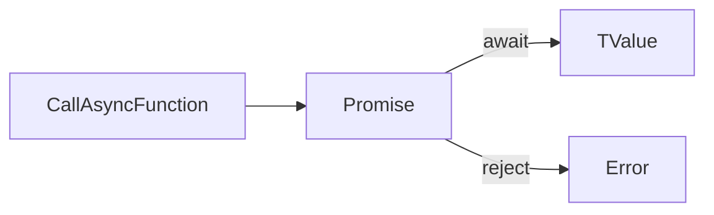

# Lesson 4: Async Patterns

## Learning Objectives

By the end of this lesson, you will be able to:
- Use `Promise<T>` types correctly and understand what `T` represents
- Write `async`/`await` code that is type-safe (including `unknown` error handling)
- Model async return types and avoid “double Promise” mistakes
- Use `Promise.all`, `Promise.allSettled`, and `Promise.race` safely
- Apply common real-world patterns (timeouts, retries, cancellation with AbortController)
- Recognize common pitfalls (missing `await`, unhandled rejections, async in loops)

## Why Async Patterns Matter

Most production code is async:
- network calls (fetching APIs)
- database queries
- file IO
- timers and background jobs

TypeScript helps you keep async code predictable by making return types explicit and catching mismatches early.



## Promises (`Promise<T>`)

TypeScript provides type safety for Promises: `T` is the resolved value type.

```typescript
function fetchData(): Promise<string> {
  return new Promise((resolve) => {
    setTimeout(() => resolve("Data loaded"), 1000);
  });
}

fetchData().then((data) => {
  console.log(data); // data: string
});
```

### Common gotcha: forgetting to return

```typescript
function bad(): Promise<string> {
  new Promise((resolve) => resolve("x")); // ❌ Promise is created but not returned
  return Promise.resolve("fallback");
}
```

## `async`/`await`

An `async` function always returns a Promise.

```typescript
type User = { id: number; name: string };

async function loadUser(id: number): Promise<User> {
  const response = await fetch(`/api/users/${id}`);
  return response.json();
}
```

### Handling errors (and why `unknown` matters)

In modern TypeScript settings, caught errors are often `unknown` (or should be treated as such).

```typescript
async function main() {
  try {
    const user = await loadUser(1);
    console.log(user.name);
  } catch (error: unknown) {
    if (error instanceof Error) {
      console.error("Failed to load user:", error.message);
      return;
    }
    console.error("Failed to load user (non-Error):", error);
  }
}
```

## Promise Type Helpers

You can alias `Promise<T>` if it helps readability, but don’t overdo it.

```typescript
type AsyncResult<T> = Promise<T>;

async function getData(): AsyncResult<string> {
  return "data";
}
```

### Extracting the resolved type (advanced)

```typescript
type Awaited2<T> = T extends Promise<infer U> ? U : T;
type R = Awaited2<Promise<number>>; // number
```

## `Promise.all` (Parallel)

`Promise.all` runs promises in parallel and rejects fast if any reject.

```typescript
type Post = { id: number; title: string };

async function loadPosts(userId: number): Promise<Post[]> {
  const response = await fetch(`/api/users/${userId}/posts`);
  return response.json();
}

async function loadMultiple(): Promise<[User, Post[]]> {
  const [user, posts] = await Promise.all([loadUser(1), loadPosts(1)]);
  return [user, posts];
}
```

### When `Promise.all` is great

- independent requests
- faster overall latency

## `Promise.allSettled` (Collect Results)

If you want all results even when some fail:

```typescript
async function loadAll() {
  const results = await Promise.allSettled([loadUser(1), loadUser(2)]);
  return results;
}
```

## Async Loops: `for...of` vs `map`

### Sequential (often required)

```typescript
async function sequential(ids: number[]) {
  const users: User[] = [];
  for (const id of ids) {
    users.push(await loadUser(id));
  }
  return users;
}
```

### Parallel (when safe)

```typescript
async function parallel(ids: number[]) {
  return await Promise.all(ids.map((id) => loadUser(id)));
}
```

## Real-World Scenario: Timeout + AbortController (Web)

```typescript
async function fetchWithTimeout(url: string, timeoutMs: number) {
  const controller = new AbortController();
  const timeout = setTimeout(() => controller.abort(), timeoutMs);

  try {
    const res = await fetch(url, { signal: controller.signal });
    return res;
  } finally {
    clearTimeout(timeout);
  }
}
```

## Best Practices

### 1) Decide: sequential vs parallel

Use parallel when operations are independent; sequential when order/rate limits matter.

### 2) Treat caught errors as `unknown`

Narrow with `instanceof Error` before using `.message`.

### 3) Always handle rejections

Await promises or return them; avoid “fire and forget” unless intentional.

## Common Pitfalls and Solutions

### Pitfall 1: Forgetting `await`

**Problem:** You treat a Promise like a value.

**Solution:** Use `await` (or `.then`) and let TS help you spot the mismatch.

### Pitfall 2: Using `forEach` with `async`

**Problem:** `forEach` doesn’t await callbacks.

**Solution:** Use `for...of` (sequential) or `Promise.all` (parallel).

### Pitfall 3: Swallowing errors

**Problem:** `catch {}` hides failures and makes debugging hard.

**Solution:** Log, return an error result, or rethrow intentionally.

## Troubleshooting

### Issue: "Property 'x' does not exist on type 'Promise<...>'"

**Symptoms:**
- You forgot to `await`, so you’re accessing properties on a Promise.

**Solutions:**
1. Add `await` to get the resolved value.
2. If inside a non-async function, return the Promise or use `.then`.

### Issue: UnhandledPromiseRejection / unhandled rejection warnings

**Symptoms:**
- Runtime warnings or process crashes.

**Solutions:**
1. Ensure every async call is awaited or returned.
2. Add `.catch(...)` at appropriate boundaries (top-level handlers).

## Next Steps

Now that you understand async patterns:

1. ✅ **Practice**: Implement sequential vs parallel loading and compare behavior
2. ✅ **Experiment**: Add a timeout using `AbortController` (web) or a manual timer pattern
3. 📖 **Next Step**: Review the TypeScript course and start the Frontend course
4. 💻 **Complete Exercises**: Work through [Exercises 08](./exercises-08.md)

## Additional Resources

- [MDN: Promises](https://developer.mozilla.org/en-US/docs/Web/JavaScript/Reference/Global_Objects/Promise)
- [MDN: async function](https://developer.mozilla.org/en-US/docs/Web/JavaScript/Reference/Statements/async_function)
- [TypeScript Handbook: Async/Await](https://www.typescriptlang.org/docs/handbook/release-notes/typescript-1-7.html#async-functions)

---

**Key Takeaways:**
- `Promise<T>` represents a future value of type `T`.
- `async` functions always return Promises; use `await` to unwrap values.
- Use `Promise.all` for parallel work; use loops for sequential work.
- Handle errors as `unknown` and narrow before using Error fields.
